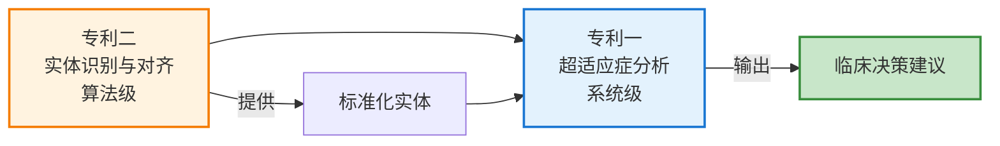

# 专利技术交底书文档说明

## 📁 文件列表

本目录包含两份完整的专利技术交底书：

### 1. [专利一：融合知识图谱与大语言模型的超适应症用药分析方法及系统](patent1_tech_disclosure.md)

**发明名称**：一种融合知识图谱与大语言模型的超适应症用药分析方法及系统

**申请类型**：发明专利

**技术领域**：人工智能、医疗信息处理、临床决策支持系统（CDSS）

**核心创新点**：
- "神经-符号"双层耦合架构（Neuro-Symbolic Dual-Layer Architecture）
- 结构化适应症列表（67,939个药品）
- 自适应融合决策算法
- 分级用药建议机制（标准用药/合理超适应症/谨慎使用/不推荐）

**权利要求**：10条（1个独立 + 9个从属）

**适用场景**：
- 临床决策支持系统
- 医保审核系统
- 药品监管平台
- 医疗质量控制

---

### 2. [专利二：基于多策略级联匹配的罕见病医疗实体识别与知识库对齐方法及装置](patent2_tech_disclosure.md)

**发明名称**：一种基于多策略级联匹配的罕见病医疗实体识别与知识库对齐方法及装置

**申请类型**：发明专利

**技术领域**：自然语言处理（NLP）、知识图谱、医疗数据治理

**核心创新点**：
- "生成-验证"双重实体链接范式
- 四级级联匹配策略（精确→同义词→模糊→回退）
- 多因子相似度验证算法（5个验证因子）
- 罕见病白名单机制
- 反馈学习机制

**权利要求**：10条（1个独立 + 9个从属）

**适用场景**：
- 电子病历结构化
- 医疗实体识别服务
- 医疗数据质量控制
- 医学知识图谱构建

---

## 🎨 Mermaid流程图

两份技术交底书均采用Mermaid格式绘制流程图，便于在Markdown查看器、GitHub、专利文档等多种环境中渲染。

### 专利一包含的图表：

**图1：系统整体架构图**
- 展示从医疗文本输入到结构化输出的完整流程
- 包含实体识别、知识增强、双通道分析、融合决策等模块
- 彩色标注关键模块（符号层、神经层、决策模块）

**图2：自适应融合决策流程图**
- 展示confidence判断逻辑
- 分支决策（确定性结论 vs 混合分析）
- 分级建议生成（合理超适应症/谨慎使用/不推荐）

### 专利二包含的图表：

**图1：系统整体架构图**
- 展示"生成-验证"双阶段流程
- 四级级联匹配策略的完整逻辑
- 罕见病白名单机制的特殊处理
- 多因子相似度验证算法的位置

**图2：多因子相似度验证算法流程图**
- 5个验证因子的顺序执行逻辑
- 每个因子的判断条件和拒绝路径
- 彩色标注（黄色=验证因子，红色=拒绝，绿色=接受）

---

## 📊 技术指标对比

### 专利一（系统级）

| 指标 | 传统规则系统 | 纯LLM系统 | 本发明 |
|------|-------------|----------|--------|
| 实体识别准确率 | 75% | 88% | **95%+** |
| 超适应症判断准确率 | 70% | 80% | **85%+** |
| 单次分析耗时 | 20-30秒 | 10-15秒 | **5-8秒** |
| 幻觉问题发生率 | 0% | 15% | **<2%** |
| 可解释性 | 低 | 中 | **高** |

### 专利二（算法级）

| 指标 | 字典匹配 | BiLSTM-CRF | 纯LLM | 本发明 |
|------|---------|-----------|-------|--------|
| 常见药品识别准确率 | 85% | 92% | 90% | **97%** |
| 罕见病识别召回率 | 40% | 55% | 70% | **90%+** |
| 误匹配率 | 25% | 15% | 10% | **<3%** |
| 知识库对齐准确率 | 70% | 75% | 80% | **95%+** |

---

## 🔗 两个专利的关系



- **专利一**：高层架构，业务价值大，保护范围广（超适应症分析完整流程）
- **专利二**：底层算法，技术深度强，形成技术壁垒（实体识别核心算法）
- **互补关系**：专利二为专利一提供底层技术支撑，两者共同构建完整的知识产权保护

---

## 📋 申请前准备清单

### ✅ 已完成

- [x] 技术交底书撰写（两份）
- [x] 背景技术分析（现有方案及缺陷）
- [x] 技术方案详细描述
- [x] Mermaid流程图绘制
- [x] 权利要求书（独立+从属）
- [x] 有益效果（定量+定性）
- [x] 实施例和验证案例
- [x] 替代方案说明

### 📝 待完成

- [ ] 填写基本信息表（申请人、发明人、联系方式）
- [ ] 准备正式专利附图（从Mermaid转换为专利格式）
- [ ] 新颖性检索（CNKI、万方、PatSnap、Google Patents）
- [ ] 与专利代理人沟通
- [ ] 确认权利要求保护范围
- [ ] 准备发明人身份证复印件等材料

---

## 🎯 专利申请建议

### 申请策略

**推荐：同时申请两个专利**
- 优势：形成专利组合，构建完整IP壁垒
- 成本：约15,000-20,000元（两个发明专利）
- 周期：12-18个月实质审查

### 时间规划

```
第1-2周: 内部审阅，完善技术细节
第3周:   与专利代理人初步沟通
第4周:   根据反馈修改交底书
第5周:   准备附图（Mermaid → 专利格式）
第6周:   提交正式申请
---
第3-6个月: 形式审查，受理通知书
第12-18个月: 实质审查，答复审查意见
第18-24个月: 授权公告（顺利的话）
```

### 注意事项

1. **保密要求**
   - 在专利申请前，不要公开发表相关技术内容
   - 不要在会议、论文、博客中透露核心算法
   - Git仓库如需开源，建议先申请专利

2. **新颖性检索**
   - 重点检索关键词：超适应症、off-label、神经符号、医疗实体识别、知识图谱
   - 确认无相同或近似专利

3. **数据真实性**
   - 文档中的性能数据应基于实际测试
   - 如果是估算值，标注为"预期"或"理论"
   - 保留测试报告作为证据

---

## 📖 查看建议

### 在GitHub/GitLab查看
- Mermaid图表会自动渲染
- 可以直接预览完整的流程图

### 在VSCode查看
- 安装"Markdown Preview Mermaid Support"插件
- 使用Markdown预览功能

### 转换为专利正式文档
- 使用mermaid-cli将Mermaid转换为PNG/SVG
- 或使用在线工具：https://mermaid.live/
- 调整图片大小和分辨率以符合专利局要求

---

## 📞 联系信息

如需修改或补充技术交底书内容，请联系：

**技术联系人**：[研发负责人]
**邮箱**：[技术联系人邮箱]
**电话**：[联系电话]

---

## 📄 许可证

本技术交底书为专利申请准备文档，内容保密。仅供内部使用和专利代理人使用。

**最后更新日期**：2025-01-30
