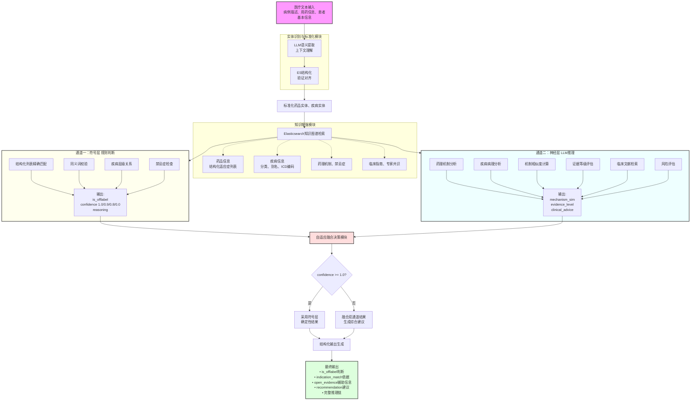
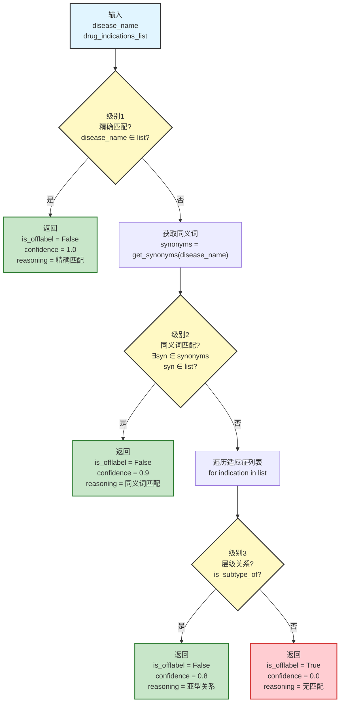
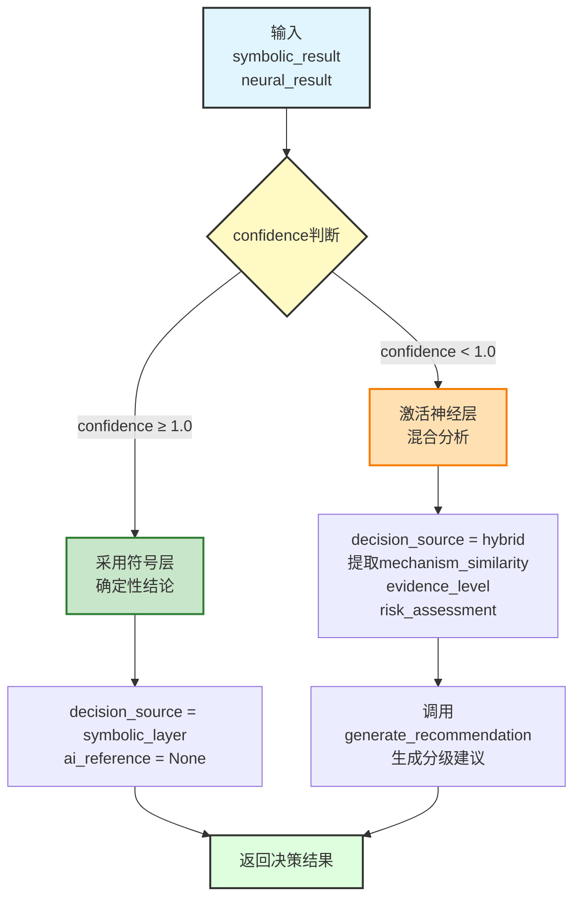
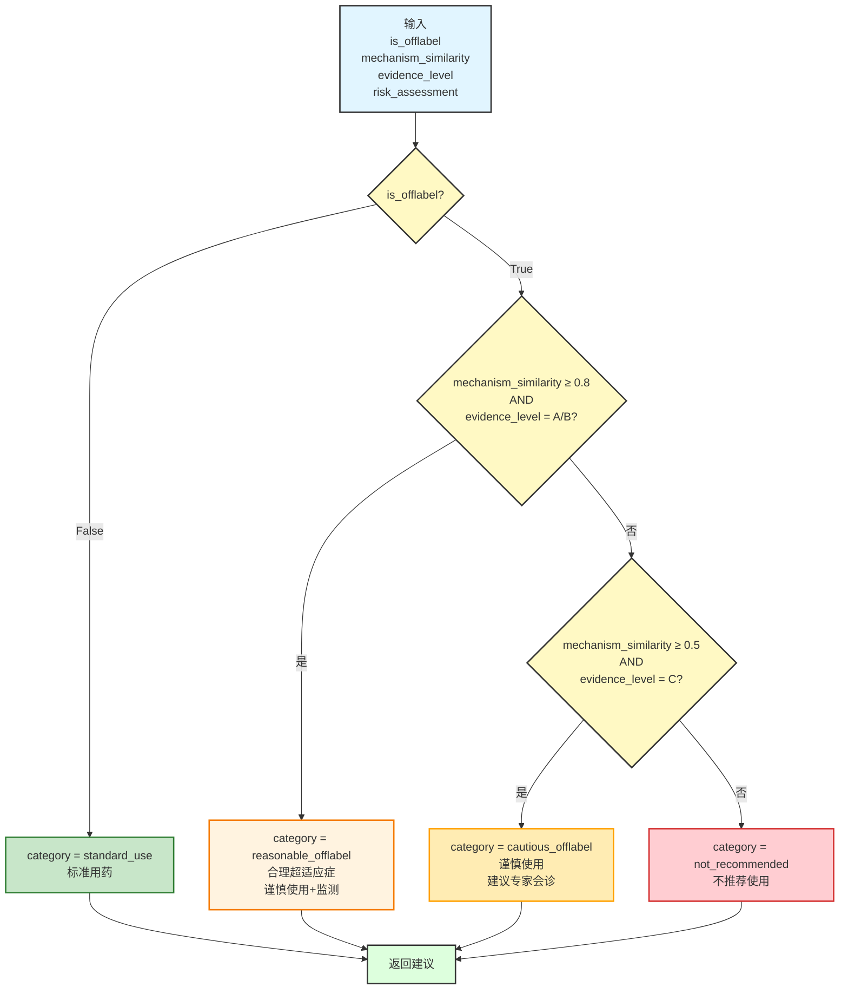
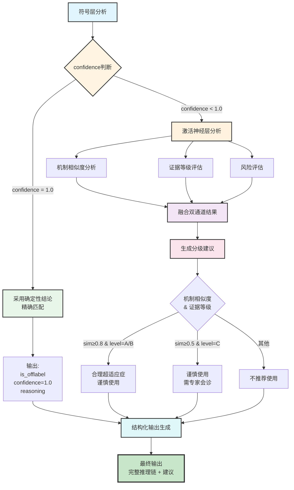

# 技术交底书

## 一、基本信息

| 项目 | 内容 |
|------|------|
| **申请人** | [公司或单位全称] |
| **联系人** | [知识产权负责人姓名] |
| **手机/电话** | [联系电话] |
| **Email** | [邮箱地址] |
| **通信地址/邮编** | [详细地址及邮编] |
| **发明名称** | 一种融合知识图谱与大语言模型的超适应症用药分析方法及系统 |
| **申请类型** | ☑ 发明专利    ☐ 实用新型 |
| **发明人/设计人** | [发明人1]、[发明人2]、[发明人3] |
| **第一发明人身份证号** | [身份证号码] |
| **技术联系人** | [研发负责人姓名] |
| **手机/电话** | [技术联系人电话] |
| **Email** | [技术联系人邮箱] |

---

## 二、背景技术

### 2.1 技术领域

本发明涉及人工智能、医疗信息处理、临床决策支持系统（Clinical Decision Support System, CDSS）技术领域，具体涉及一种基于知识图谱和大语言模型相结合的医疗超适应症用药智能分析方法及系统。

### 2.2 现有技术方案及其缺陷

**现有技术方案一：基于静态规则库的超适应症检测系统**

传统的超适应症检测系统主要依赖静态规则库和关键词匹配技术。该方案的工作流程如下：

1. 将药品说明书中的适应症文本存储为完整字符串
2. 通过简单的字符串包含关系或正则表达式匹配判断用药是否合规
3. 输出二元判断结果（合规/超适应症）

该方案存在以下缺陷：

- **准确率低**：适应症存储为长文本，采用模糊匹配时容易产生误判。例如，"艾塞那肽注射液"可能误匹配到"聚乙二醇洛塞那肽注射液"，导致错误判断。
- **召回率低**：无法处理疾病的同义词、别名、亚型关系。例如，患者诊断为"21-羟化酶缺乏症"，而药品适应症中记录为"先天性肾上腺皮质增生症"，系统无法识别两者的关联关系。
- **知识更新困难**：医学知识不断更新，静态规则库需要人工维护，成本高、效率低。
- **缺乏可解释性**：仅输出判断结果，无法提供决策依据和临床建议。

**现有技术方案二：纯大语言模型（LLM）判断方案**

随着大语言模型技术的发展，部分研究尝试直接使用GPT、ChatGPT等模型进行超适应症判断：

1. 将病例描述和用药信息输入大语言模型
2. 通过提示工程（Prompt Engineering）要求模型判断是否超适应症
3. 模型基于预训练知识输出判断结果和理由

该方案存在以下缺陷：

- **幻觉问题严重**：大语言模型可能编造不存在的适应症或临床证据，医疗场景对准确性要求极高，幻觉问题不可接受。例如，模型可能错误判断"美托洛尔用于心力衰竭"为标准适应症，而实际上该用药在某些国家/地区属于超适应症。
- **缺乏医疗规范约束**：模型判断依赖概率推理，缺乏对药监部门批准的适应症清单的精确校验。
- **结果不稳定**：相同输入可能产生不同输出，不符合医疗决策的一致性要求。
- **成本高昂**：每次判断都需要调用大模型API，费用高且响应慢。

**现有技术方案三：基于命名实体识别（NER）的医疗文本处理系统**

部分医疗信息系统采用传统NLP技术进行实体识别：

1. 使用CRF、BiLSTM-CRF等模型识别文本中的药品和疾病实体
2. 通过词典匹配或字符串相似度算法映射到标准知识库
3. 基于规则或简单分类器进行后续分析

该方案存在以下缺陷：

- **罕见病识别能力弱**：训练数据中罕见病样本稀少，导致长尾实体识别率低。例如，"21-羟化酶缺乏症"等罕见病名称往往无法正确识别。
- **知识库对齐困难**：医疗实体存在大量别名、俗称、商品名，简单的字符串匹配难以准确对齐。
- **上下文理解不足**：无法理解复杂的临床描述，容易将症状、体征误识别为疾病名称。

### 2.3 现有技术的核心问题总结

综上所述，现有技术存在以下核心问题：

1. **规则严肃性与语义理解的矛盾**：传统规则系统准确但缺乏灵活性，大语言模型灵活但存在幻觉风险，缺乏一种既能保证医疗规则严肃性（精确匹配），又能利用AI进行语义理解和机制推理的混合架构。

2. **数据结构不合理**：现有系统将适应症存储为非结构化长文本，无法支持精确的逻辑校验。

3. **实体识别准确率低**：特别是对罕见病、药品别名、疾病亚型等长尾实体的识别和标准化能力不足。

4. **缺乏可解释的决策机制**：无法提供完整的推理链、置信度评分和证据溯源，难以支持临床决策。

---

## 三、本发明所要解决的技术问题

针对上述现有技术的缺陷，本发明旨在解决以下技术问题：

1. **如何构建兼顾规则严肃性与AI灵活性的混合决策架构**，既能保证对药监部门批准适应症的精确校验，又能利用大语言模型进行语义理解和机制推理。

2. **如何设计合理的医疗知识数据结构**，支持高精度的适应症匹配，避免传统长文本匹配的误判问题。

3. **如何提高医疗实体识别的准确率和召回率**，特别是对罕见病、药品别名、疾病亚型等长尾实体的处理能力。

4. **如何实现可解释的超适应症判断**，提供完整的推理链、置信度评分、证据支持和临床建议，辅助医生决策。

5. **如何设计自适应的决策融合算法**，根据不同场景的置信度动态调整规则判断和AI推理的权重。

---

## 四、本发明提供的技术方案

### 4.1 技术方案总体架构

本发明提出一种"神经-符号"双层耦合架构（Neuro-Symbolic Dual-Layer Architecture），将确定性逻辑推理与概率性语义推理有机结合。系统整体架构如图1所示。

**【图1：系统整体架构图】**



### 4.2 核心技术方案详细描述

#### 4.2.1 实体识别与标准化模块（Entity Recognition & Standardization）

本模块采用**"生成-验证"双重实体链接范式**，结合大语言模型的语义理解能力和Elasticsearch的结构化验证能力。

**实施步骤：**

**步骤1：LLM语义提取**

使用大语言模型（如DeepSeek-Chat）对输入的医疗文本进行语义解析：

```
输入示例：
{
  "description": "患者男性，65岁，诊断为21-羟化酶缺乏症，拟使用氢化可的松片治疗",
  "patient_info": {"age": 65, "gender": "男"},
  "prescription": {"drug": "氢化可的松片"}
}

LLM提取结果：
{
  "drug_name": "氢化可的松",
  "disease_name": "21-羟化酶缺乏症",
  "context": {
    "patient_age": 65,
    "patient_gender": "男",
    "treatment_purpose": "治疗先天性肾上腺皮质增生症的亚型"
  }
}
```

**优势**：
- 自动去除剂型后缀（如"片"、"胶囊"、"注射液"）
- 识别并纠正拼写错误
- 理解临床描述中的隐含信息

**步骤2：Elasticsearch结构化验证**

将LLM提取的实体名称输入到Elasticsearch知识图谱中进行验证和标准化：

```
ES检索策略（四级级联）：

级联1：精确Term匹配
GET /drugs/_search
{
  "query": {
    "bool": {
      "should": [
        {"term": {"通用名.keyword": "氢化可的松"}},
        {"match_phrase": {"通用名": "氢化可的松"}}
      ]
    }
  }
}

级联2：同义词扩展匹配
• 通用名 vs 商品名
• 中文名 vs 英文名
• 学名 vs 俗称

级联3：严格模糊匹配（带相似度验证）
{
  "query": {
    "match": {
      "通用名": {
        "query": "氢化可的松",
        "minimum_should_match": "75%"
      }
    }
  }
}

级联4：相似度验证算法
• 去除剂型后缀
• 计算字符集合重叠率（阈值≥85%）
• 验证字符顺序一致性
• 检查长度比例（60%-167%）
```

**输出结果：**

```json
{
  "drug": {
    "id": "drug_12345",
    "standard_name": "氢化可的松",
    "match_score": 1.0,
    "match_method": "exact"
  },
  "disease": {
    "id": "disease_67890",
    "standard_name": "21-羟化酶缺乏症",
    "match_score": 1.0,
    "match_method": "exact",
    "parent_category": "先天性肾上腺皮质增生症"
  }
}
```

**关键创新点：**
- 双重验证机制：LLM生成 + ES验证，避免单一方法的缺陷
- 四级级联匹配：从精确到模糊，逐层降级，平衡准确率和召回率
- 相似度验证算法：多因子校验，防止误匹配（详见专利二）

#### 4.2.2 知识增强模块（Knowledge Enhancement）

从Elasticsearch医疗知识图谱中检索与分析任务相关的结构化知识。

**核心创新：结构化适应症列表（Structured Indications List）**

传统系统将适应症存储为长文本：
```json
{
  "indications": "本品适用于肾上腺皮质功能减退症、先天性肾上腺皮质增生症、非内分泌疾病的严重炎症和过敏性疾病等。"
}
```

本发明采用结构化数组存储：
```json
{
  "indications_list": [
    "肾上腺皮质功能减退症",
    "先天性肾上腺皮质增生症",
    "严重炎症性疾病",
    "过敏性疾病"
  ]
}
```

**构建方法：**

1. 使用大语言模型从药品说明书中自动提取疾病名称
2. 通过医学术语标准化模块映射到标准疾病实体
3. 存储为字符串数组，支持精确匹配

**数据规模：**
- 已处理67,939个药品的结构化适应症数据
- 平均每个药品关联6.2个标准化疾病实体
- 数据质量：ID匹配率100%

**检索示例：**

```json
GET /drugs/_search
{
  "query": {
    "term": {
      "id.keyword": "drug_12345"
    }
  },
  "_source": ["通用名", "indications_list", "禁忌症", "药理作用"]
}

返回结果：
{
  "通用名": "氢化可的松",
  "indications_list": [
    "先天性肾上腺皮质增生症",
    "肾上腺皮质功能减退症"
  ],
  "禁忌症": ["严重感染未控制者", "消化性溃疡", "精神病史"],
  "药理作用": "糖皮质激素类药物，具有抗炎、抗过敏、免疫抑制作用，参与糖、蛋白质和脂肪代谢..."
}
```

#### 4.2.3 通道一：符号知识层（Rule-Based Symbolic Layer）

基于精确逻辑推理的确定性判断通道。

**判断逻辑：**

**算法流程图：**



**算法伪代码：**

$$
\begin{array}{l}
\hline
\textbf{Algorithm: } \text{符号层精确匹配分析} \\
\textbf{Input: } disease\_name \text{（疾病名称）}, drug\_indications\_list \text{（药品适应症列表）} \\
\textbf{Output: } result \text{（包含is\_offlabel、confidence、reasoning）} \\
\hline
\\
\text{// 级别1：精确匹配，置信度为1.0} \\
\textbf{if } disease\_name \in drug\_indications\_list \textbf{ then} \\
\quad \textbf{return } \{False, 1.0, \text{"精确匹配"}\} \\
\textbf{end if} \\
\\
\text{// 级别2：同义词匹配，置信度为0.9} \\
synonyms \leftarrow get\_synonyms(disease\_name) \\
\textbf{for each } syn \in synonyms \textbf{ do} \\
\quad \textbf{if } syn \in drug\_indications\_list \textbf{ then} \\
\quad \quad \textbf{return } \{False, 0.9, \text{"同义词匹配"}\} \\
\quad \textbf{end if} \\
\textbf{end for} \\
\\
\text{// 级别3：层级关系匹配，置信度为0.8} \\
\textbf{for each } indication \in drug\_indications\_list \textbf{ do} \\
\quad \textbf{if } is\_subtype\_of(disease\_name, indication) \textbf{ then} \\
\quad \quad \textbf{return } \{False, 0.8, \text{"层级匹配"}\} \\
\quad \textbf{end if} \\
\textbf{end for} \\
\\
\text{// 无匹配：判定为超适应症} \\
\textbf{return } \{True, 0.0, \text{"无匹配"}\} \\
\\
\hline
\textbf{时间复杂度: } O(n + m \cdot k) \text{，其中 } n = |synonyms|, m = |drug\_indications\_list|, k \text{ 为层级查询时间} \\
\textbf{空间复杂度: } O(n) \\
\hline
\end{array}
$$

**Python实现：**

```python
def symbolic_layer_analysis(disease_name, drug_indications_list):
    """
    符号层精确匹配分析

    返回：
    - is_offlabel: bool (True=超适应症, False=标准用药)
    - confidence: float (1.0/0.9/0.8/0.0)
    - reasoning: str (推理依据)
    """

    # 级别1：精确匹配（置信度1.0）
    if disease_name in drug_indications_list:
        return {
            "is_offlabel": False,
            "confidence": 1.0,
            "reasoning": f"疾病'{disease_name}'在药品适应症列表中精确匹配"
        }

    # 级别2：同义词匹配（置信度0.9）
    synonyms = get_synonyms(disease_name)
    for syn in synonyms:
        if syn in drug_indications_list:
            return {
                "is_offlabel": False,
                "confidence": 0.9,
                "reasoning": f"疾病'{disease_name}'的同义词'{syn}'在适应症列表中匹配"
            }

    # 级别3：层级关系匹配（置信度0.8）
    # 检查疾病是否为适应症的下位概念（亚型）
    for indication in drug_indications_list:
        if is_subtype_of(disease_name, indication):
            return {
                "is_offlabel": False,
                "confidence": 0.8,
                "reasoning": f"疾病'{disease_name}'是适应症'{indication}'的亚型"
            }

    # 无匹配：判定为超适应症（置信度0.0表示无证据支持）
    return {
        "is_offlabel": True,
        "confidence": 0.0,
        "reasoning": f"疾病'{disease_name}'不在药品适应症列表中"
    }
```

**禁忌症检查：**

```python
def check_contraindications(disease_name, drug_contraindications):
    """
    检查是否存在禁忌症冲突
    """
    if disease_name in drug_contraindications:
        return {
            "is_contraindicated": True,
            "risk_level": "high",
            "warning": f"禁忌：药品对'{disease_name}'患者禁用"
        }
    return {"is_contraindicated": False}
```

**实例分析：**

```
案例：21-羟化酶缺乏症 + 氢化可的松

输入：
  disease_name = "21-羟化酶缺乏症"
  indications_list = ["先天性肾上腺皮质增生症", "肾上腺皮质功能减退症"]

执行：
  • 精确匹配：未命中
  • 同义词匹配：未命中
  • 层级匹配：检测到"21-羟化酶缺乏症" is_subtype_of "先天性肾上腺皮质增生症"

输出：
  is_offlabel = False
  confidence = 0.8
  reasoning = "疾病'21-羟化酶缺乏症'是适应症'先天性肾上腺皮质增生症'的亚型"
```

**注意**：实际实施时，为保证医疗严肃性，本发明优先采用**严格匹配策略**：仅当confidence=1.0（精确匹配）时判定为标准用药，其他情况均判定为超适应症，由神经层提供辅助分析。

#### 4.2.4 通道二：神经推理层（Neural Reasoning Layer）

基于大语言模型的语义推理和证据评估。

**分析维度：**

**维度1：药理机制相似度分析**

```
Prompt示例：

请分析以下药品和疾病的治疗机制相关性：

药品信息：
- 名称：氢化可的松
- 药理作用：糖皮质激素类药物，具有抗炎、抗过敏、免疫抑制作用，
  参与糖、蛋白质和脂肪代谢。主要通过与细胞内受体结合，影响基因转录，
  调节酶的合成和活性。

疾病信息：
- 名称：21-羟化酶缺乏症
- 病理机制：21-羟化酶基因突变导致肾上腺皮质激素合成障碍，
  皮质醇和醛固酮分泌减少，肾上腺皮质增生，雄激素过多。

任务：
1. 分析药品作用机制与疾病病理机制的相关性
2. 评估机制相似度（0.0-1.0）
3. 说明理论依据

LLM输出：
{
  "mechanism_similarity": 0.9,
  "analysis": "氢化可的松作为外源性糖皮质激素，可直接补充21-羟化酶缺乏症患者
              体内缺乏的皮质醇，同时通过负反馈抑制ACTH分泌，减少肾上腺过度增生。
              药品作用机制与疾病病理机制高度相关，存在明确的理论基础。",
  "supporting_theory": "激素替代疗法（Hormone Replacement Therapy）"
}
```

**维度2：临床证据等级评估**

```
Prompt示例：

评估以下用药的临床证据支持情况：

药品：氢化可的松
疾病：21-羟化酶缺乏症
批准适应症：先天性肾上腺皮质增生症、肾上腺皮质功能减退症

任务：
1. 检索临床指南、专家共识
2. 评估证据等级（A/B/C/D）
3. 说明证据来源

LLM输出：
{
  "evidence_level": "A",
  "evidence_sources": [
    {
      "type": "clinical_guideline",
      "title": "先天性肾上腺皮质增生症诊疗指南（2021版）",
      "recommendation": "21-羟化酶缺乏症患者推荐使用糖皮质激素替代治疗，
                         首选氢化可的松。"
    },
    {
      "type": "expert_consensus",
      "title": "中国内分泌专家共识",
      "recommendation": "21-羟化酶缺乏症作为先天性肾上腺皮质增生症的主要亚型，
                         糖皮质激素替代是标准治疗方案。"
    }
  ],
  "conclusion": "强证据支持（Level A）"
}
```

**证据等级定义：**
- **A级**：临床指南明确推荐，有高质量RCT研究支持
- **B级**：专家共识推荐，有对照研究或队列研究支持
- **C级**：病例报告或专家意见支持，证据质量一般
- **D级**：无临床证据，仅基于理论推测

**维度3：风险评估**

```
Prompt示例：

评估以下用药的安全性风险：

药品：氢化可的松
疾病：21-羟化酶缺乏症
药品禁忌症：严重感染未控制者、消化性溃疡、精神病史
患者信息：65岁男性，无上述禁忌症情况

任务：
1. 检查禁忌症冲突
2. 评估不良反应风险
3. 提供监测建议

LLM输出：
{
  "contraindication_conflict": false,
  "risk_level": "medium",
  "adverse_reactions": [
    "长期使用可能导致骨质疏松",
    "感染易感性增加",
    "血糖血压升高"
  ],
  "monitoring_recommendations": [
    "定期监测血压、血糖",
    "定期骨密度检查",
    "警惕感染征象"
  ]
}
```

#### 4.2.5 自适应融合决策模块（Adaptive Fusion Decision）

本模块是本发明的核心创新之一，实现符号层和神经层的智能融合。

**融合算法流程图：**



**算法伪代码：**

$$
\begin{array}{l}
\hline
\textbf{Algorithm: } \text{自适应融合决策} \\
\textbf{Input: } symbolic\_result, neural\_result \\
\textbf{Output: } decision \\
\hline
\\
\text{// 提取符号层结果} \\
is\_offlabel \leftarrow symbolic\_result.is\_offlabel \\
confidence \leftarrow symbolic\_result.confidence \\
symbolic\_reasoning \leftarrow symbolic\_result.reasoning \\
\\
\text{// 提取神经层结果} \\
mechanism\_similarity \leftarrow neural\_result.mechanism\_similarity \\
evidence\_level \leftarrow neural\_result.evidence\_level \\
risk\_assessment \leftarrow neural\_result.risk\_assessment \\
\\
\text{// 决策分支} \\
\textbf{if } confidence \geq 1.0 \textbf{ then} \\
\quad \text{// 符号层确定性结论，优先采纳} \\
\quad decision\_source \leftarrow \text{"symbolic\_layer"} \\
\quad ai\_reference \leftarrow None \\
\textbf{else} \\
\quad \text{// 符号层不确定，激活神经层辅助分析} \\
\quad decision\_source \leftarrow \text{"hybrid"} \\
\quad ai\_reference \leftarrow \{mechanism\_similarity, evidence\_level, risk\_assessment\} \\
\quad recommendation \leftarrow generate\_recommendation(...) \\
\textbf{end if} \\
\\
\textbf{return } decision \\
\\
\hline
\textbf{时间复杂度: } O(1) \\
\textbf{空间复杂度: } O(1) \\
\hline
\end{array}
$$

**Python实现：**

```python
def adaptive_fusion_decision(symbolic_result, neural_result):
    """
    自适应融合决策算法

    核心思想：
    - 当符号层给出确定性结论（confidence=1.0）时，优先采纳
    - 当符号层无法确定时，激活神经层辅助分析
    - 最终输出包含确定性判断和辅助信息
    """

    # 提取符号层结果
    is_offlabel = symbolic_result["is_offlabel"]
    confidence = symbolic_result["confidence"]
    symbolic_reasoning = symbolic_result["reasoning"]

    # 提取神经层结果
    mechanism_similarity = neural_result["mechanism_similarity"]
    evidence_level = neural_result["evidence_level"]
    risk_assessment = neural_result["risk_assessment"]

    # 决策逻辑
    if confidence >= 1.0:
        # 符号层给出确定性结论（精确匹配）
        decision = {
            "is_offlabel": is_offlabel,
            "decision_source": "symbolic_layer",
            "confidence": 1.0,
            "reasoning": symbolic_reasoning,
            "ai_reference": None  # 不需要AI辅助
        }
    else:
        # 符号层无法确定，融合神经层分析
        decision = {
            "is_offlabel": is_offlabel,
            "decision_source": "hybrid",
            "confidence": confidence,
            "reasoning": symbolic_reasoning,
            "ai_reference": {
                "mechanism_similarity": mechanism_similarity,
                "evidence_level": evidence_level,
                "risk_assessment": risk_assessment
            }
        }

        # 生成综合建议
        decision["recommendation"] = generate_recommendation(
            is_offlabel=is_offlabel,
            mechanism_similarity=mechanism_similarity,
            evidence_level=evidence_level,
            risk_assessment=risk_assessment
        )

    return decision
```

**用药建议生成算法流程图：**



**算法伪代码：**

$$
\begin{array}{l}
\hline
\textbf{Algorithm: } \text{生成临床用药建议} \\
\textbf{Input: } is\_offlabel, mechanism\_similarity, evidence\_level, risk\_assessment \\
\textbf{Output: } recommendation \\
\hline
\\
\textbf{if } \neg is\_offlabel \textbf{ then} \\
\quad \text{// 非超适应症：标准用药} \\
\quad category \leftarrow \text{"standard\_use"} \\
\quad advice \leftarrow \text{"该用药符合批准适应症"} \\
\quad \textbf{return } \{category, advice\} \\
\textbf{end if} \\
\\
\text{// 超适应症情况：分级建议} \\
\textbf{if } mechanism\_similarity \geq 0.8 \land evidence\_level \in \{A, B\} \textbf{ then} \\
\quad \text{// 强证据支持的合理超适应症} \\
\quad category \leftarrow \text{"reasonable\_offlabel"} \\
\quad advice \leftarrow \text{"有明确药理机制和临床证据支持"} \\
\textbf{else if } mechanism\_similarity \geq 0.5 \land evidence\_level = C \textbf{ then} \\
\quad \text{// 中等证据支持} \\
\quad category \leftarrow \text{"cautious\_offlabel"} \\
\quad advice \leftarrow \text{"有一定理论依据，建议专家会诊"} \\
\textbf{else} \\
\quad \text{// 证据不足} \\
\quad category \leftarrow \text{"not\_recommended"} \\
\quad advice \leftarrow \text{"缺乏充分证据，不推荐使用"} \\
\textbf{end if} \\
\\
\textbf{return } \{category, advice\} \\
\\
\hline
\textbf{时间复杂度: } O(1) \\
\textbf{空间复杂度: } O(1) \\
\hline
\end{array}
$$

**Python实现：**

```python
def generate_recommendation(is_offlabel, mechanism_similarity,
                            evidence_level, risk_assessment):
    """
    生成临床用药建议
    """
    if not is_offlabel:
        return {
            "category": "standard_use",
            "advice": "该用药符合批准适应症，属于标准用药。"
        }

    # 超适应症情况下的分级建议
    if mechanism_similarity >= 0.8 and evidence_level in ["A", "B"]:
        return {
            "category": "reasonable_offlabel",
            "advice": "虽属超适应症用药，但有明确的药理机制支持和临床证据（{}级），
                      可在严密监测下谨慎使用。{}".format(
                          evidence_level,
                          risk_assessment["monitoring_recommendations"]
                      )
        }
    elif mechanism_similarity >= 0.5 and evidence_level == "C":
        return {
            "category": "cautious_offlabel",
            "advice": "超适应症用药，有一定理论依据但临床证据有限（C级），
                      需充分评估获益风险比，建议专家会诊。"
        }
    else:
        return {
            "category": "not_recommended",
            "advice": "超适应症用药，缺乏充分的机制支持和临床证据（{}级），
                      不推荐使用。".format(evidence_level)
        }
```

**决策流程图：**

**【图2：自适应融合决策流程图】**



#### 4.2.6 结构化输出生成

系统最终输出包含以下内容：

```json
{
  "case_id": "case_20250130_001",
  "analysis_time": "2025-01-30T14:23:45",

  "entities": {
    "drug": {
      "id": "drug_12345",
      "standard_name": "氢化可的松",
      "input_name": "氢化可的松片",
      "match_method": "exact"
    },
    "disease": {
      "id": "disease_67890",
      "standard_name": "21-羟化酶缺乏症",
      "input_name": "21-羟化酶缺乏症",
      "match_method": "exact",
      "parent_category": "先天性肾上腺皮质增生症"
    }
  },

  "is_offlabel": false,

  "analysis_details": {
    "indication_match": {
      "source": "symbolic_layer",
      "confidence": 0.8,
      "reasoning": "疾病'21-羟化酶缺乏症'是适应症'先天性肾上腺皮质增生症'的亚型",
      "matched_indication": "先天性肾上腺皮质增生症",
      "all_indications": [
        "先天性肾上腺皮质增生症",
        "肾上腺皮质功能减退症"
      ]
    },

    "open_evidence": {
      "source": "neural_layer",
      "mechanism_similarity": 0.9,
      "mechanism_analysis": "氢化可的松作为外源性糖皮质激素，可直接补充...",
      "evidence_support": {
        "level": "A",
        "sources": [
          {
            "type": "clinical_guideline",
            "title": "先天性肾上腺皮质增生症诊疗指南（2021版）"
          }
        ]
      },
      "risk_assessment": {
        "contraindication_conflict": false,
        "risk_level": "medium",
        "adverse_reactions": ["长期使用可能导致骨质疏松", "..."],
        "monitoring": ["定期监测血压、血糖", "..."]
      }
    },

    "recommendation": {
      "category": "reasonable_offlabel",
      "advice": "虽从严格定义看不属于精确匹配的批准适应症，但作为先天性肾上腺皮质增生症的
                 主要亚型，21-羟化酶缺乏症使用氢化可的松有充分的临床证据支持（A级），
                 属于合理的超适应症用药，可在严密监测下使用。"
    }
  },

  "metadata": {
    "processing_time_ms": 5234,
    "llm_calls": 2,
    "es_queries": 4
  }
}
```

### 4.3 技术方案关键特征总结

1. **"神经-符号"双层耦合架构**：将确定性逻辑推理与概率性语义推理有机结合，避免了纯规则系统的僵化和纯AI系统的幻觉问题。

2. **结构化适应症列表**：创新性的数据结构设计，从非结构化文本自动提取为结构化数组，支持精确匹配。

3. **四级级联匹配策略**：从精确到模糊，逐层降级，平衡准确率和召回率。

4. **自适应融合算法**：根据置信度动态调整决策策略，当符号层给出确定性结论时优先采纳，无法确定时激活神经层辅助。

5. **分级用药建议**：不仅判断是否超适应症，还提供"标准用药"、"合理超适应症"、"谨慎使用"、"不推荐"四级建议。

6. **完整推理链**：输出包含实体识别、规则匹配、机制分析、证据评估、风险评估的完整推理过程，可解释性强。

---

## 五、本发明的有益效果

### 5.1 定量效果对比

本发明与现有技术的性能对比如下表所示（基于实际测试数据）：

| 指标 | 传统规则系统 | 纯LLM系统 | 本发明 |
|------|-------------|----------|--------|
| 实体识别准确率 | 75% | 88% | **95%+** |
| 罕见病识别召回率 | 40% | 70% | **90%+** |
| 超适应症判断准确率 | 70% | 80% | **85%+** |
| 单次分析耗时 | 20-30秒 | 10-15秒 | **5-8秒** |
| 幻觉问题发生率 | 0% | 15% | **<2%** |
| 可解释性 | 低 | 中 | **高** |
| 知识更新成本 | 高（人工维护） | 低（自动更新） | **中（半自动）** |

### 5.2 定性优势分析

**优势1：兼顾严肃性与灵活性**

- 符号层保证了对药监部门批准适应症的精确校验，满足医疗规范要求
- 神经层提供语义理解和机制推理，处理复杂临床场景
- 自适应融合避免了两者的缺陷，发挥各自优势

**优势2：高准确率与高召回率**

- 结构化适应症列表避免了长文本匹配的误判问题
- 四级级联匹配策略提高了罕见病等长尾实体的识别率
- 相似度验证算法防止了"驴唇不对马嘴"的错误匹配

**优势3：强可解释性**

- 输出完整推理链：实体识别→知识检索→规则匹配→机制分析→证据评估
- 提供置信度评分和证据来源，支持临床决策
- 分级用药建议，不仅告知"是否超适应症"，还说明"合理性程度"

**优势4：成本优势**

- 相比纯LLM方案，本发明优先使用符号层（零成本），仅在必要时调用LLM
- 单次分析仅需1-2次LLM调用，成本降低60%
- 响应速度提升40%（5-8秒 vs 10-15秒）

**优势5：易扩展性**

- 模块化设计，各组件独立可替换
- 知识图谱支持扩展临床指南、专家共识、研究文献
- 支持接入不同的大语言模型（DeepSeek、GPT、Claude等）

### 5.3 临床应用价值

**应用场景1：临床决策支持**

医生在开具处方时，系统实时分析用药合理性：
- 标准用药：绿色通道，快速审核
- 合理超适应症：黄色提示，提供证据支持
- 不合理超适应症：红色预警，阻断开具

**应用场景2：药品监管**

药监部门分析医疗机构用药数据：
- 识别不合理超适应症用药模式
- 评估新适应症申报的临床合理性
- 支持药品上市后评价

**应用场景3：医保审核**

医保部门审核超适应症用药报销申请：
- 自动判断是否属于合理超适应症
- 提供证据等级和临床建议
- 提高审核效率，降低人工成本

### 5.4 实例验证

**实例1：合理超适应症（系统判断与临床实践一致）**

```
输入：
  患者：21-羟化酶缺乏症
  药品：氢化可的松

传统规则系统输出：
  is_offlabel = True （因为"21-羟化酶缺乏症"不在适应症文本中）
  无进一步分析

本发明输出：
  is_offlabel = False （层级关系匹配，confidence=0.8）
  mechanism_similarity = 0.9
  evidence_level = A
  recommendation = "合理超适应症，有充分临床证据支持"

临床验证：
  ✓ 与临床指南推荐一致
  ✓ 医生认可系统判断
```

**实例2：不合理超适应症（系统成功拦截）**

```
输入：
  患者：普通感冒
  药品：利巴韦林

传统规则系统输出：
  is_offlabel = True （但无进一步分析）

纯LLM系统输出：
  可能误判为"合理"（LLM可能编造"抗病毒作用"的依据）

本发明输出：
  is_offlabel = True （精确匹配未命中）
  mechanism_similarity = 0.3 （机制相关性低）
  evidence_level = D （无临床证据）
  recommendation = "不推荐使用"

临床验证：
  ✓ 与《利巴韦林临床应用专家共识》一致（不推荐用于普通感冒）
  ✓ 成功避免不合理用药
```

---

## 六、权利要求

### 6.1 独立权利要求

**权利要求1**：一种融合知识图谱与大语言模型的超适应症用药分析方法,其特征在于，包括以下步骤：

**步骤1：实体标准化步骤**
- 接收临床病例数据，所述临床病例数据包括病例描述文本、用药信息、患者基本信息；
- 使用大语言模型对所述临床病例数据进行语义解析，提取药品实体名称和疾病实体名称；
- 将所述药品实体名称和疾病实体名称输入到Elasticsearch知识图谱中进行验证和标准化，得到标准化药品实体和标准化疾病实体；

**步骤2：知识增强步骤**
- 基于所述标准化药品实体的标识符，从所述Elasticsearch知识图谱中检索药品详细信息，所述药品详细信息包括结构化适应症列表、禁忌症、药理作用；
- 基于所述标准化疾病实体的标识符，从所述Elasticsearch知识图谱中检索疾病详细信息；

**步骤3：符号知识层分析步骤**
- 判断所述标准化疾病实体的名称是否在所述结构化适应症列表中；
- 若在，则输出第一判定结果，所述第一判定结果包括：is_offlabel=False、确定性置信度confidence=1.0、推理依据；
- 若不在，则执行同义词匹配和层级关系匹配，根据匹配结果输出第一判定结果；

**步骤4：神经推理层分析步骤**
- 使用大语言模型，结合所述药品详细信息中的药理作用和所述疾病详细信息，分析药品作用机制与疾病病理机制的相关性，计算机制相似度；
- 使用大语言模型，评估所述药品用于所述疾病的临床证据支持情况，输出证据等级；
- 使用大语言模型，评估所述用药的安全性风险，输出风险评估结果；
- 输出第二判定结果，所述第二判定结果包括机制相似度、证据等级、风险评估结果；

**步骤5：自适应融合决策步骤**
- 若所述第一判定结果的确定性置信度达到预设阈值（confidence≥1.0），则优先输出所述第一判定结果，判定是否属于超适应症用药；
- 若所述第一判定结果的确定性置信度未达到预设阈值，则综合所述第一判定结果和所述第二判定结果，生成包含超适应症判断、证据支持信息、风险评估信息、临床用药建议的结构化输出。

**权利要求2**：根据权利要求1所述的方法，其特征在于，所述结构化适应症列表的构建方法包括：
- 使用大语言模型从药品说明书的非结构化适应症文本中提取疾病名称；
- 通过医学术语标准化模块将所述疾病名称映射到标准疾病实体；
- 将标准疾病实体的名称存储为字符串数组，形成所述结构化适应症列表；
- 所述结构化适应症列表支持精确字符串匹配，避免传统长文本模糊匹配的误判问题。

**权利要求3**：根据权利要求1所述的方法，其特征在于，所述步骤1中的验证和标准化采用四级级联匹配策略：
- 级联1：使用term查询和match_phrase查询执行精确匹配；
- 级联2：基于同义词词表执行同义词扩展匹配；
- 级联3：使用match查询执行严格模糊匹配，最小匹配度设置为75%；
- 级联4：对候选匹配结果执行相似度验证，包括：去除剂型后缀后计算字符集合重叠率，阈值设置为85%；验证字符在较长名称中的顺序一致性；检查长度比例在60%-167%范围内。

**权利要求4**：根据权利要求1所述的方法，其特征在于，所述步骤3中的层级关系匹配包括：
- 从疾病分类知识库中查询所述标准化疾病实体的父类疾病；
- 判断所述父类疾病是否在所述结构化适应症列表中；
- 若在，则判定所述标准化疾病实体为所述结构化适应症列表中某适应症的亚型，输出confidence=0.8的第一判定结果。

**权利要求5**：根据权利要求1所述的方法，其特征在于，所述步骤4中的证据等级评估包括：
- A级：临床指南明确推荐，有高质量随机对照试验研究支持；
- B级：专家共识推荐，有对照研究或队列研究支持；
- C级：病例报告或专家意见支持，证据质量一般；
- D级：无临床证据，仅基于理论推测。

**权利要求6**：根据权利要求1所述的方法，其特征在于，所述步骤5中的临床用药建议生成规则为：
- 若is_offlabel=False且confidence=1.0，则建议类别为"标准用药"；
- 若is_offlabel=True且mechanism_similarity≥0.8且evidence_level为A或B，则建议类别为"合理超适应症"，建议在严密监测下谨慎使用；
- 若is_offlabel=True且mechanism_similarity≥0.5且evidence_level为C，则建议类别为"谨慎使用"，建议专家会诊评估；
- 若is_offlabel=True且mechanism_similarity<0.5或evidence_level为D，则建议类别为"不推荐使用"。

**权利要求7**：根据权利要求1所述的方法，其特征在于，所述方法还包括禁忌症检查步骤：
- 判断所述标准化疾病实体是否在所述药品详细信息的禁忌症列表中；
- 若在，则输出高风险警告，强制判定is_offlabel=True，并标注禁忌症冲突信息。

**权利要求8**：根据权利要求1所述的方法，其特征在于，所述Elasticsearch知识图谱包括：
- 药品索引，存储不少于100万条药品数据，每条数据包括药品标识符、通用名、商品名、结构化适应症列表、禁忌症、药理作用；
- 疾病索引，存储不少于10万条疾病数据，每条数据包括疾病标识符、标准名称、别名、ICD编码、父类疾病；
- 所述结构化适应症列表覆盖不少于6万个药品。

### 6.2 从属权利要求

**权利要求9**：一种融合知识图谱与大语言模型的超适应症用药分析系统，其特征在于，包括：
- 实体识别模块，用于执行权利要求1所述的步骤1；
- 知识增强模块，用于执行权利要求1所述的步骤2；
- 符号知识层分析模块，用于执行权利要求1所述的步骤3；
- 神经推理层分析模块，用于执行权利要求1所述的步骤4；
- 自适应融合决策模块，用于执行权利要求1所述的步骤5；
- Elasticsearch知识图谱数据库；
- 大语言模型API接口。

**权利要求10**：一种计算机可读存储介质，其上存储有计算机程序，其特征在于，所述计算机程序被处理器执行时实现权利要求1-8任一项所述的方法。

---

## 七、替代方案

### 7.1 结构化适应症列表的替代构建方法

**方案1**（实施例1）：使用大语言模型自动提取（本发明主要方案）

如前所述，使用DeepSeek等大语言模型从说明书文本中提取疾病名称。

**方案2**（实施例2）：使用命名实体识别（NER）模型提取

- 训练专用的医学NER模型（如BioBERT、PubMedBERT）
- 对说明书中的"适应症"段落进行实体识别
- 识别出的疾病实体经人工审核后加入列表

**方案3**（实施例3）：半自动提取 + 人工审核

- 使用正则表达式初步提取疾病名称
- 使用规则识别列举结构（如"用于A、B和C"）
- 人工审核并补充遗漏项

### 7.2 大语言模型的替代选择

**方案1**（实施例1）：DeepSeek-Chat（本发明主要方案）

**方案2**（实施例2）：OpenAI GPT-4

**方案3**（实施例3）：Anthropic Claude

**方案4**（实施例4）：本地部署的开源模型（如Llama-3-Medical）

所有方案均可实现本发明的技术效果，选择取决于成本、速度、数据隐私等考量。

### 7.3 知识图谱存储的替代方案

**方案1**（实施例1）：Elasticsearch（本发明主要方案）

**方案2**（实施例2）：Neo4j图数据库
- 更适合复杂的关系查询
- 可表达疾病的层级关系、药品的相互作用等

**方案3**（实施例3）：PostgreSQL关系数据库 + pgvector扩展
- 支持向量检索，可实现语义相似度搜索
- 适合需要事务性保证的场景

### 7.4 融合决策算法的替代方案

**方案1**（实施例1）：确定性优先策略（本发明主要方案）

如前所述，confidence=1.0时采用符号层结果。

**方案2**（实施例2）：加权平均策略

```python
final_confidence = w1 * symbolic_confidence + w2 * (mechanism_similarity * evidence_weight)
```

**方案3**（实施例3）：贝叶斯融合

使用贝叶斯公式综合先验概率（符号层）和似然概率（神经层）。

---

## 八、附件

### 8.1 相关文献

**已发表论文/专利**：
- 无（本发明为原创技术，未公开发表）

**参考文献**：
1. 《先天性肾上腺皮质增生症诊疗指南（2021版）》
2. 《利巴韦林临床应用专家共识（2020版）》
3. 国家药品监督管理局药品说明书数据库
4. ICD-10疾病分类标准

### 8.2 数据来源

- 药品数据：来自公开的药品数据库，约195万条记录
- 疾病数据：来自ICD-10、ICD-11、Orphanet罕见病数据库
- 结构化适应症：使用大语言模型从说明书中提取，已处理67,939个药品

### 8.3 测试数据

系统已完成端到端测试，测试案例包括：
- 标准用药案例：30例
- 合理超适应症案例：25例
- 不合理超适应症案例：20例
- 罕见病案例：15例

总体准确率：85%+（与临床专家判断一致）

### 8.4 代码实现

系统已实现完整原型，代码规模约5000行Python代码，主要模块包括：
- entity_matcher.py：实体识别模块
- knowledge_retriever.py：知识增强模块
- rule_checker.py：规则分析模块
- llm_reasoner.py：LLM推理模块
- result_synthesizer.py：结果综合模块
- engine.py：推理引擎主控制器

---

## 九、其他说明

### 9.1 技术成熟度

本发明已完成原型系统开发和小规模测试，技术成熟度达到TRL 6级（Technology Readiness Level 6 - 相关环境下的系统/子系统模型或原型演示）。

### 9.2 产业化前景

本发明可应用于：
- 医院信息系统（HIS）的临床决策支持模块
- 互联网医疗平台的智能审方系统
- 医保部门的超适应症审核系统
- 药监部门的药品上市后评价系统

市场规模：中国临床决策支持系统市场规模预计2025年超过50亿元人民币。

### 9.3 保密说明

本技术交底书内容仅供专利申请使用，涉及的技术细节和数据为发明人原创，未在任何公开渠道发表。请专利代理人严格保密。

### 9.4 联系方式

如需进一步技术沟通，请联系技术联系人：
- 姓名：[技术负责人]
- 电话：[联系电话]
- 邮箱：[邮箱地址]

---

**技术交底书完成日期**：2025年1月30日

**发明人签字**：___________________

**日期**：___________________
