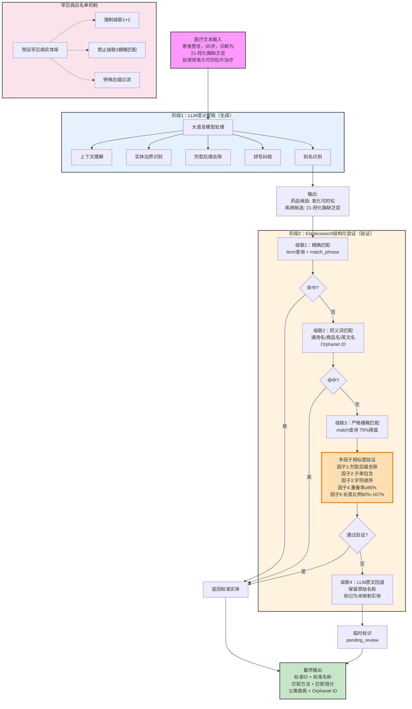
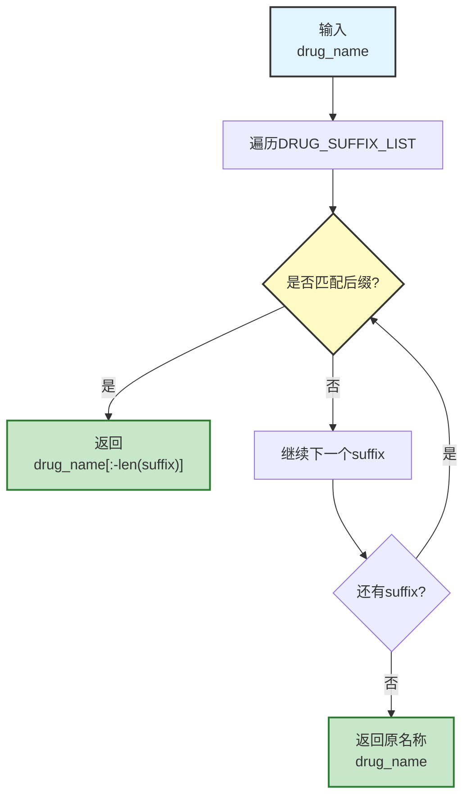
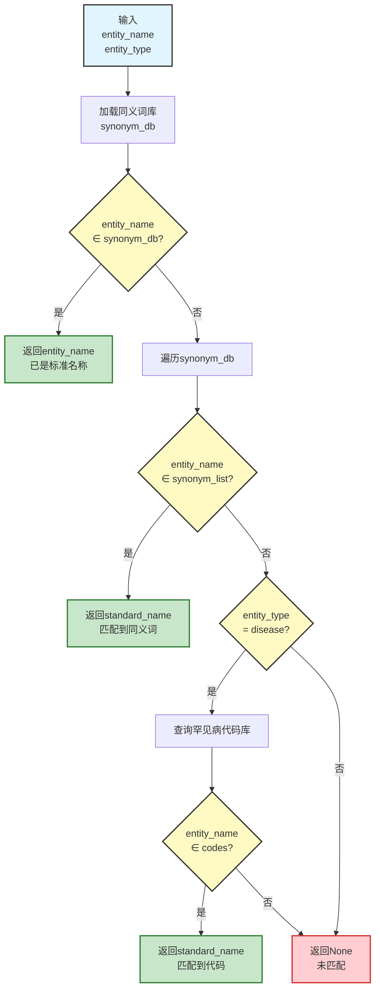
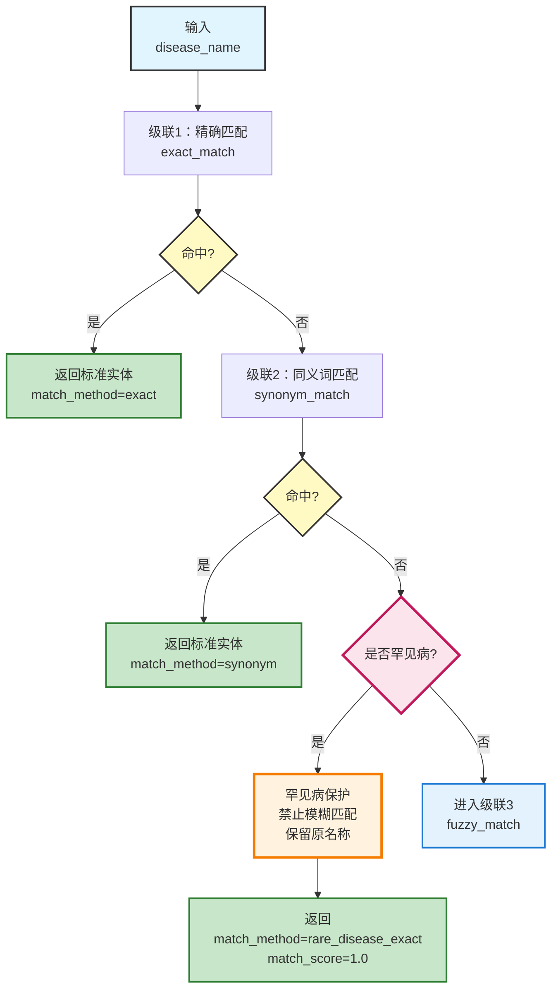
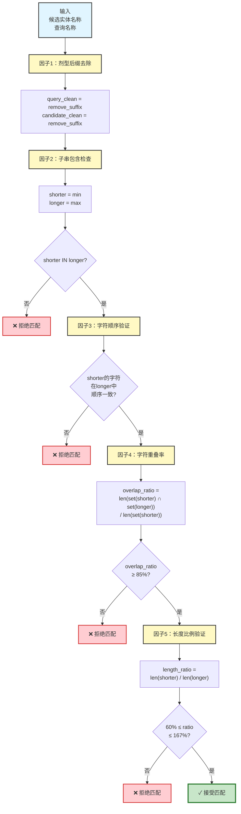

# 技术交底书

## 一、基本信息

| 项目 | 内容 |
|------|------|
| **申请人** | [公司或单位全称] |
| **联系人** | [知识产权负责人姓名] |
| **手机/电话** | [联系电话] |
| **Email** | [邮箱地址] |
| **通信地址/邮编** | [详细地址及邮编] |
| **发明名称** | 一种基于多策略级联匹配的罕见病医疗实体识别与知识库对齐方法及装置 |
| **申请类型** | ☑ 发明专利    ☐ 实用新型 |
| **发明人/设计人** | [发明人1]、[发明人2]、[发明人3] |
| **第一发明人身份证号** | [身份证号码] |
| **技术联系人** | [研发负责人姓名] |
| **手机/电话** | [技术联系人电话] |
| **Email** | [技术联系人邮箱] |

---

## 二、背景技术

### 2.1 技术领域

本发明涉及自然语言处理（NLP）、知识图谱、医疗数据治理技术领域，具体涉及一种面向罕见病场景的医疗实体识别与多策略知识库对齐方法及装置。

### 2.2 现有技术方案及其缺陷

**现有技术方案一：基于字典匹配的医疗实体识别**

传统的医疗实体识别系统主要依赖字典匹配技术：

1. 构建医疗术语词典（药品词典、疾病词典）
2. 对输入文本进行分词或字符串扫描
3. 通过精确匹配或编辑距离（Levenshtein Distance）计算相似度
4. 返回匹配度最高的标准实体

该方案存在以下缺陷：

- **罕见病识别率低**：罕见病名称复杂、变异多，词典往往无法覆盖所有别名。例如，"21-羟化酶缺乏症"可能以"21-OHD"、"CYP21A2缺陷"等形式出现，字典匹配难以全部收录。
- **上下文理解能力弱**：无法理解临床描述的语境，容易将症状、体征误识别为疾病名称。例如，"患者出现肾上腺皮质功能减退"可能被误识别为"肾上腺皮质功能减退症"。
- **误匹配问题严重**：简单的字符串相似度计算容易产生"驴唇不对马嘴"的错误。例如，"艾塞那肽"可能匹配到"聚乙二醇洛塞那肽"（相似度高但实际是不同药品）。

**现有技术方案二：基于深度学习的命名实体识别（NER）**

随着深度学习技术发展，部分系统采用BiLSTM-CRF、BERT等模型进行医疗实体识别：

1. 使用大规模医疗语料训练序列标注模型
2. 对输入文本进行实体边界识别和分类
3. 输出识别到的实体及其类型（药品/疾病/检查等）

该方案存在以下缺陷：

- **长尾实体识别困难**：罕见病在训练数据中出现频率极低，模型对这类实体的识别能力弱。研究表明，对于出现频次低于10次的实体，BERT模型的F1分数通常低于60%。
- **知识库对齐困难**：NER模型只能识别实体边界和类型，无法直接映射到知识库的标准ID。需要额外的实体链接（Entity Linking）步骤，而该步骤往往依赖简单的字符串匹配，仍存在误匹配问题。
- **标注成本高昂**：训练高质量NER模型需要大量人工标注数据，特别是罕见病领域，标注成本极高且难以获取。

**现有技术方案三：基于大语言模型（LLM）的实体提取**

近期部分研究尝试使用GPT、ChatGPT等大语言模型进行实体提取：

1. 通过提示工程（Prompt Engineering）要求模型提取实体
2. 模型基于预训练知识输出实体名称和类型
3. 可处理复杂语境和零样本学习场景

该方案存在以下缺陷：

- **幻觉问题**：大语言模型可能编造不存在的实体或修改原文信息。例如，将"21-羟化酶缺乏症"擅自"纠正"为"先天性肾上腺皮质增生症"，导致信息失真。
- **缺乏标准化约束**：LLM输出的实体名称可能不符合医学术语标准，难以直接用于后续分析。
- **无法保证一致性**：相同输入可能产生不同输出，不符合医疗数据治理的一致性要求。

**现有技术方案四：混合方法（NER + 实体链接）**

部分先进系统采用"识别-链接"两阶段方法：

1. 阶段1：使用NER模型识别实体边界
2. 阶段2：使用实体链接算法将识别结果映射到知识库

实体链接算法通常包括：
- 候选生成：通过字符串相似度检索候选实体
- 候选排序：基于上下文特征对候选实体排序
- 消歧决策：选择最可能的标准实体

该方案存在以下缺陷：

- **误差累积**：两阶段方法会产生误差累积，NER错误会影响后续链接效果。
- **策略单一**：实体链接通常只使用一种匹配策略（如余弦相似度），难以平衡精确率和召回率。
- **罕见病优化不足**：通用算法未针对罕见病特点进行优化，对于罕见病的长名称、多别名、低频出现等特点处理不佳。

### 2.3 现有技术的核心问题总结

综上所述，现有技术在医疗实体识别与知识库对齐方面存在以下核心问题：

1. **罕见病识别能力弱**：长尾实体识别率低，特别是罕见病、药品别名、疾病亚型等。

2. **误匹配问题严重**：简单的字符串相似度计算容易产生"驴唇不对马嘴"的错误匹配，如"艾塞那肽"误匹配"聚乙二醇洛塞那肽"。

3. **匹配策略单一**：缺乏多层次、多策略的级联匹配机制，无法平衡精确率和召回率。

4. **知识库对齐困难**：医疗实体存在严重的异构性（标准名、通用名、商品名、俗称、代码等），简单匹配难以准确对齐。

5. **缺乏可解释性**：无法提供匹配的置信度、匹配路径、验证依据等信息。

---

## 三、本发明所要解决的技术问题

针对上述现有技术的缺陷，本发明旨在解决以下技术问题：

1. **如何提高罕见病等长尾实体的识别准确率和召回率**，特别是处理罕见病的多别名、复杂命名、低频出现等特点。

2. **如何设计有效的多因子相似度验证算法**，避免"驴唇不对马嘴"的误匹配问题，特别是在药品名称相似但实际不同的情况下。

3. **如何构建多层次、多策略的级联匹配机制**，既保证高精确率（精确匹配、同义词匹配），又保证高召回率（模糊匹配、语义匹配）。

4. **如何实现医疗实体与知识库的高精度对齐**，处理标准名、通用名、商品名、俗称、罕见病代码等多维度异构信息。

5. **如何处理未匹配到标准实体的情况**，支持新实体发现和知识库扩充。

---

## 四、本发明提供的技术方案

### 4.1 技术方案总体架构

本发明提出一种**"生成-验证"双重实体链接范式**，结合大语言模型的语义理解能力和Elasticsearch的结构化验证能力，并采用**四级级联匹配策略**和**多因子相似度验证算法**。系统整体架构如图1所示。

**【图1：系统整体架构图】**



### 4.2 核心技术方案详细描述

#### 4.2.1 阶段1：LLM语义提取（"生成"）

使用大语言模型对输入的医疗文本进行语义解析，利用其强大的语境理解能力处理复杂临床描述。

**处理步骤：**

**步骤1：上下文理解**

大语言模型能够理解句子的语义结构，区分实体、症状、治疗目的等不同成分。

```
输入示例：
"患者男性，65岁，诊断为21-羟化酶缺乏症，既往有肾上腺皮质功能减退史，
 拟使用氢化可的松片治疗，剂量10mg bid"

LLM理解结果：
{
  "patient_info": {
    "age": 65,
    "gender": "男"
  },
  "diagnosis": "21-羟化酶缺乏症",  // 主诊断
  "medical_history": ["肾上腺皮质功能减退"],  // 既往史，非当前诊断
  "treatment_plan": {
    "drug": "氢化可的松片",
    "dosage": "10mg bid"
  }
}
```

**优势**：
- 区分主诊断和既往史，避免误提取
- 识别药品和剂量信息
- 理解临床术语的隐含关系

**步骤2：剂型后缀自动去除**

医疗文本中药品通常包含剂型（如"片"、"胶囊"、"注射液"），需要去除后才能与知识库对齐。

**算法流程图：**



**算法伪代码：**

$$
\begin{array}{l}
\hline
\textbf{Algorithm: } \text{去除药品剂型后缀} \\
\textbf{Input: } drug\_name \text{（药品名称字符串）} \\
\textbf{Output: } cleaned\_name \text{（去除后缀后的药品名称）} \\
\textbf{Predefined: } DRUG\_SUFFIX\_LIST = [\text{'片', '胶囊', '颗粒', '注射液', ...}] \\
\hline
\\
\textbf{for each } suffix \in DRUG\_SUFFIX\_LIST \textbf{ do} \\
\quad \textbf{if } drug\_name.endswith(suffix) \textbf{ then} \\
\quad \quad \textbf{return } drug\_name[0 : |drug\_name| - |suffix|] \\
\quad \textbf{end if} \\
\textbf{end for} \\
\\
\text{// 未匹配任何后缀，返回原名称} \\
\textbf{return } drug\_name \\
\\
\hline
\textbf{时间复杂度: } O(k \cdot m) \text{，其中 } k = |DRUG\_SUFFIX\_LIST| \approx 19, m = avg(|suffix|) \approx 3 \\
\quad \text{实际约为 } O(1) \text{ 常数时间} \\
\textbf{空间复杂度: } O(1) \\
\hline
\end{array}
$$

**Python实现：**

```python
DRUG_SUFFIX_LIST = [
    '片', '胶囊', '颗粒', '注射液', '软膏', '滴眼液',
    '缓释片', '肠溶片', '分散片', '咀嚼片', '泡腾片',
    '软胶囊', '硬胶囊', '微球', '粉针剂', '冻干粉',
    '喷雾剂', '气雾剂', '栓剂', '贴剂'
]

def remove_suffix(drug_name: str) -> str:
    """
    去除药品名称中的剂型后缀

    示例：
    "氢化可的松片" → "氢化可的松"
    "阿司匹林肠溶片" → "阿司匹林"
    "重组人胰岛素注射液" → "重组人胰岛素"
    """
    for suffix in DRUG_SUFFIX_LIST:
        if drug_name.endswith(suffix):
            return drug_name[:-len(suffix)]
    return drug_name
```

**步骤3：拼写纠错**

利用LLM的思维链（Chain of Thought）能力自动识别并纠正拼写错误。

```
输入："患者诊断为21-羟化梅缺乏症"  // "酶"误写为"梅"

LLM处理：
<think>
"21-羟化梅缺乏症"疑似拼写错误，"梅"应为"酶"（enzyme）。
医学上存在"21-羟化酶缺乏症"，是一种罕见的遗传性疾病。
</think>

输出："21-羟化酶缺乏症"
```

**步骤4：别名识别**

LLM能够识别医学术语的常见别名和缩写。

```
输入别名映射示例：
"21-OHD" → "21-羟化酶缺乏症"
"CAH" → "先天性肾上腺皮质增生症"
"MG" → "重症肌无力"
"Aspirin" → "阿司匹林"
```

**输出结果：**

```json
{
  "drug": {
    "extracted_name": "氢化可的松",
    "original_text": "氢化可的松片",
    "removed_suffix": "片",
    "context": "用于治疗21-羟化酶缺乏症"
  },
  "disease": {
    "extracted_name": "21-羟化酶缺乏症",
    "original_text": "21-羟化酶缺乏症",
    "alternative_names": ["21-OHD", "21-hydroxylase deficiency"],
    "context": "先天性肾上腺皮质增生症的主要亚型"
  }
}
```

**关键创新点：**
- 利用LLM的语境理解能力，避免传统NER的边界识别错误
- 自动处理剂型、别名、拼写错误等变异
- 保留原始文本和上下文信息，便于后续验证

#### 4.2.2 阶段2：Elasticsearch结构化验证（"验证"）

将LLM提取的候选实体名称输入到Elasticsearch知识图谱中进行验证和标准化，采用四级级联匹配策略。

##### 4.2.2.1 级联1：精确匹配

使用term查询和match_phrase查询进行精确匹配。

**技术实现：**

```json
GET /drugs/_search
{
  "query": {
    "bool": {
      "should": [
        {
          "term": {
            "通用名.keyword": "氢化可的松"
          }
        },
        {
          "match_phrase": {
            "通用名": "氢化可的松"
          }
        },
        {
          "term": {
            "商品名.keyword": "氢化可的松"
          }
        }
      ],
      "minimum_should_match": 1
    }
  },
  "size": 5
}
```

**匹配规则：**
- term查询：对keyword类型字段进行精确匹配，不分词
- match_phrase查询：对text类型字段进行短语匹配，保持词序

**输出：**
- 若命中：返回标准实体，match_method="exact"，match_score=1.0
- 若未命中：进入级联2

##### 4.2.2.2 级联2：同义词匹配

基于预构建的同义词词表进行扩展匹配。

**同义词词表结构：**

```json
{
  "drug_synonyms": {
    "氢化可的松": [
      "Hydrocortisone",
      "可的索",
      "皮质醇"
    ],
    "阿司匹林": [
      "Aspirin",
      "乙酰水杨酸",
      "拜阿司匹灵"  // 商品名
    ]
  },
  "disease_synonyms": {
    "21-羟化酶缺乏症": [
      "21-OHD",
      "21-hydroxylase deficiency",
      "CYP21A2缺陷"
    ],
    "先天性肾上腺皮质增生症": [
      "CAH",
      "Congenital Adrenal Hyperplasia"
    ]
  },
  "rare_disease_codes": {
    "21-羟化酶缺乏症": {
      "orphanet_id": "ORPHA:418",
      "icd10": "E25.0",
      "omim": "201910"
    }
  }
}
```

**匹配策略流程图：**



**算法伪代码：**

$$
\begin{array}{l}
\hline
\textbf{Algorithm: } \text{同义词匹配} \\
\textbf{Input: } entity\_name \text{（候选实体名称）}, entity\_type \text{（实体类型: drug/disease）} \\
\textbf{Output: } standard\_name \text{（标准实体名称）或 None} \\
\hline
\\
synonym\_db \leftarrow load\_synonym\_database(entity\_type) \\
\\
\text{// 方法1：直接查询（已是标准名称）} \\
\textbf{if } entity\_name \in synonym\_db.keys() \textbf{ then} \\
\quad \textbf{return } entity\_name \\
\textbf{end if} \\
\\
\text{// 方法2：反向查询（匹配同义词）} \\
\textbf{for each } (standard\_name, synonym\_list) \in synonym\_db \textbf{ do} \\
\quad \textbf{if } entity\_name \in synonym\_list \textbf{ then} \\
\quad \quad \textbf{return } standard\_name \\
\quad \textbf{end if} \\
\textbf{end for} \\
\\
\text{// 方法3：罕见病代码查询（仅针对疾病）} \\
\textbf{if } entity\_type = \text{"disease"} \textbf{ then} \\
\quad \textbf{for each } (standard\_name, codes) \in rare\_disease\_codes \textbf{ do} \\
\quad \quad \textbf{if } entity\_name \in codes.values() \textbf{ then} \\
\quad \quad \quad \textbf{return } standard\_name \\
\quad \quad \textbf{end if} \\
\quad \textbf{end for} \\
\textbf{end if} \\
\\
\text{// 未匹配到任何同义词} \\
\textbf{return } None \\
\\
\hline
\textbf{时间复杂度: } O(n \cdot m) \text{，其中 } n = |synonym\_db|, m = avg(|synonym\_list|) \\
\textbf{空间复杂度: } O(n \cdot m) \text{（存储同义词词表）} \\
\hline
\end{array}
$$

**Python实现：**

```python
def synonym_match(entity_name: str, entity_type: str) -> Optional[str]:
    """
    同义词匹配

    参数：
    - entity_name: 候选实体名称
    - entity_type: 实体类型（drug/disease）

    返回：
    - 标准实体名称，若未匹配则返回None
    """
    synonym_db = load_synonym_database(entity_type)

    # 方法1：直接查询
    if entity_name in synonym_db:
        return entity_name  # 已是标准名称

    # 方法2：反向查询
    for standard_name, synonym_list in synonym_db.items():
        if entity_name in synonym_list:
            return standard_name  # 匹配到同义词

    # 方法3：罕见病代码查询（针对疾病）
    if entity_type == "disease":
        for standard_name, codes in rare_disease_codes.items():
            if entity_name in codes.values():
                return standard_name

    return None
```

**特殊处理：罕见病白名单机制**

对于预设的罕见病实体库，强制优先执行级联1和级联2，禁止进入级联3的模糊匹配。

**算法流程图：**



**算法伪代码：**

$$
\begin{array}{l}
\hline
\textbf{Algorithm: } \text{带罕见病保护的匹配} \\
\textbf{Input: } disease\_name \text{（疾病名称）} \\
\textbf{Output: } \text{标准实体对象 或 模糊匹配结果} \\
\textbf{Predefined: } RARE\_DISEASE\_WHITELIST \text{（罕见病白名单）} \\
\hline
\\
\text{// 级联1：精确匹配} \\
result \leftarrow exact\_match(disease\_name) \\
\textbf{if } result \neq None \textbf{ then} \\
\quad \textbf{return } result \\
\textbf{end if} \\
\\
\text{// 级联2：同义词匹配} \\
result \leftarrow synonym\_match(disease\_name, \text{"disease"}) \\
\textbf{if } result \neq None \textbf{ then} \\
\quad \textbf{return } result \\
\textbf{end if} \\
\\
\text{// 罕见病保护检查} \\
\textbf{if } disease\_name \in RARE\_DISEASE\_WHITELIST \textbf{ then} \\
\quad \text{// 罕见病：禁止模糊匹配，保留原名称} \\
\quad \textbf{return } \{ \\
\quad \quad standard\_name: disease\_name, \\
\quad \quad match\_method: \text{"rare\_disease\_exact"}, \\
\quad \quad match\_score: 1.0, \\
\quad \quad note: \text{"罕见病白名单保护，禁止模糊匹配"} \\
\quad \} \\
\textbf{end if} \\
\\
\text{// 非罕见病：进入级联3模糊匹配} \\
\textbf{return } fuzzy\_match(disease\_name) \\
\\
\hline
\textbf{时间复杂度: } O(n) \text{，其中 } n = |RARE\_DISEASE\_WHITELIST| \approx 7{,}000 \\
\quad \text{实际使用哈希表优化到 } O(1) \\
\textbf{空间复杂度: } O(n) \text{（存储罕见病白名单）} \\
\hline
\end{array}
$$

**Python实现：**

```python
RARE_DISEASE_WHITELIST = [
    "21-羟化酶缺乏症",
    "11β-羟化酶缺乏症",
    "17α-羟化酶缺乏症",
    "苯丙酮尿症",
    "戈谢病",
    "法布雷病",
    "庞贝病",
    # ... 更多罕见病
]

def is_rare_disease(disease_name: str) -> bool:
    """判断是否为罕见病"""
    return disease_name in RARE_DISEASE_WHITELIST

def match_with_rare_disease_protection(disease_name: str):
    """
    带罕见病保护的匹配

    罕见病只执行精确匹配和同义词匹配，禁止模糊匹配
    """
    # 级联1：精确匹配
    result = exact_match(disease_name)
    if result:
        return result

    # 级联2：同义词匹配
    result = synonym_match(disease_name, "disease")
    if result:
        return result

    # 检查是否为罕见病
    if is_rare_disease(disease_name):
        # 罕见病：禁止进入级联3，保留原名称
        return {
            "standard_name": disease_name,
            "match_method": "rare_disease_exact",
            "match_score": 1.0,
            "note": "罕见病白名单保护，禁止模糊匹配"
        }

    # 非罕见病：进入级联3
    return fuzzy_match(disease_name)
```

**输出：**
- 若命中：返回标准实体，match_method="synonym"，match_score=0.95
- 若未命中且为罕见病：保留原名称，match_method="rare_disease_exact"
- 若未命中且非罕见病：进入级联3

##### 4.2.2.3 级联3：严格模糊匹配

使用Elasticsearch的match查询进行分词后的词项匹配。

**技术实现：**

```json
GET /drugs/_search
{
  "query": {
    "match": {
      "通用名": {
        "query": "氢化可的松",
        "minimum_should_match": "75%"
      }
    }
  },
  "size": 10
}
```

**匹配原理：**
- 对查询词和文档字段分词
- 计算词项重叠比例
- minimum_should_match=75%表示至少75%的词项需要匹配

**示例：**

```
查询："聚乙二醇洛塞那肽"
分词：["聚", "乙", "二", "醇", "洛", "塞", "那", "肽"]

候选1："艾塞那肽"
分词：["艾", "塞", "那", "肽"]
重叠：["塞", "那", "肽"] = 3个
重叠率：3/8 = 37.5% < 75%  → 不匹配 ✓（正确拒绝）

候选2："聚乙二醇洛塞那肽注射液"
分词：["聚", "乙", "二", "醇", "洛", "塞", "那", "肽", "注", "射", "液"]
重叠：["聚", "乙", "二", "醇", "洛", "塞", "那", "肽"] = 8个
重叠率：8/8 = 100% ≥ 75%  → 候选匹配
```

**关键特征：**
- 设置75%的高阈值，避免误匹配
- 返回多个候选结果，需要进一步验证

**输出：**
- 若有候选：进入多因子相似度验证算法
- 若无候选：进入级联4

##### 4.2.2.4 多因子相似度验证算法（核心创新）

这是本发明的核心创新算法，通过多个因子的综合验证，避免"驴唇不对马嘴"的误匹配。

**算法流程图：**

**【图2：多因子相似度验证算法流程图】**



**算法伪代码：**

$$
\begin{array}{l}
\hline
\textbf{Algorithm: } \text{多因子相似度验证} \\
\textbf{Input: } query\_name, candidate\_name, threshold \text{（默认0.85）} \\
\textbf{Output: } bool \text{（True=接受匹配, False=拒绝匹配）} \\
\hline
\\
\text{// 因子1：剔除剂型后缀} \\
query\_clean \leftarrow remove\_suffix(query\_name) \\
candidate\_clean \leftarrow remove\_suffix(candidate\_name) \\
\\
\text{// 因子2：子串包含检查} \\
shorter \leftarrow \min(query\_clean, candidate\_clean) \text{ by length} \\
longer \leftarrow \max(query\_clean, candidate\_clean) \text{ by length} \\
\textbf{if } shorter \notin longer \textbf{ then} \\
\quad \textbf{return } False \quad \text{// 拒绝：不满足子串关系} \\
\textbf{end if} \\
\\
\text{// 因子3：字符顺序验证（双指针算法）} \\
shorter\_chars \leftarrow list(shorter) \\
longer\_chars \leftarrow list(longer) \\
j \leftarrow 0 \quad \text{// longer的指针} \\
\textbf{for } i \leftarrow 0 \text{ to } |shorter\_chars| - 1 \textbf{ do} \\
\quad char \leftarrow shorter\_chars[i] \\
\quad found \leftarrow False \\
\quad \textbf{while } j < |longer\_chars| \textbf{ do} \\
\quad \quad \textbf{if } longer\_chars[j] = char \textbf{ then} \\
\quad \quad \quad found \leftarrow True \\
\quad \quad \quad j \leftarrow j + 1 \\
\quad \quad \quad \textbf{break} \\
\quad \quad \textbf{end if} \\
\quad \quad j \leftarrow j + 1 \\
\quad \textbf{end while} \\
\quad \textbf{if } \neg found \textbf{ then} \\
\quad \quad \textbf{return } False \quad \text{// 拒绝：字符顺序不一致} \\
\quad \textbf{end if} \\
\textbf{end for} \\
\\
\text{// 因子4：字符集合重叠率} \\
query\_chars \leftarrow set(query\_clean) \\
candidate\_chars \leftarrow set(candidate\_clean) \\
intersection \leftarrow query\_chars \cap candidate\_chars \\
min\_set\_size \leftarrow \min(|query\_chars|, |candidate\_chars|) \\
overlap\_ratio \leftarrow |intersection| / min\_set\_size \\
\textbf{if } overlap\_ratio < threshold \textbf{ then} \\
\quad \textbf{return } False \quad \text{// 拒绝：字符重叠率低于阈值} \\
\textbf{end if} \\
\\
\text{// 因子5：长度比例验证} \\
length\_ratio \leftarrow |shorter| / |longer| \\
\textbf{if } length\_ratio < 0.6 \textbf{ then} \\
\quad \textbf{return } False \quad \text{// 拒绝：长度差异过大} \\
\textbf{end if} \\
\\
\text{// 所有因子验证通过} \\
\textbf{return } True \\
\\
\hline
\textbf{时间复杂度: } O(n \cdot m + n \cdot \log(n)) \\
\quad \text{其中 } n = \max(|query\_clean|, |candidate\_clean|), m = |longer\_chars| \\
\quad \text{子串检查: } O(n \cdot m), \text{ 字符顺序验证: } O(n \cdot m), \text{ 集合操作: } O(n) \\
\textbf{空间复杂度: } O(n) \text{（存储字符集合和列表）} \\
\hline
\end{array}
$$

**Python实现：**

```python
def multi_factor_similarity_validation(query_name: str,
                                      candidate_name: str,
                                      threshold: float = 0.85) -> bool:
    """
    多因子相似度验证算法

    参数：
    - query_name: 查询的实体名称
    - candidate_name: 候选匹配的实体名称
    - threshold: 字符重叠率阈值（默认85%）

    返回：
    - True: 通过验证，可以匹配
    - False: 未通过验证，拒绝匹配
    """

    # ==================== 因子1：剔除剂型后缀 ====================
    query_clean = remove_suffix(query_name)
    candidate_clean = remove_suffix(candidate_name)

    # ==================== 因子2：子串包含检查 ====================
    # 确定较短和较长的名称
    if len(query_clean) <= len(candidate_clean):
        shorter = query_clean
        longer = candidate_clean
    else:
        shorter = candidate_clean
        longer = query_clean

    # 检查较短名称是否为较长名称的子串
    if shorter not in longer:
        return False  # 拒绝：不满足子串关系

    # ==================== 因子3：字符顺序验证 ====================
    # 验证shorter中的字符在longer中的出现顺序是否一致
    shorter_chars = list(shorter)
    longer_chars = list(longer)

    # 使用双指针验证顺序
    j = 0  # longer的指针
    for i in range(len(shorter_chars)):
        char = shorter_chars[i]
        found = False
        while j < len(longer_chars):
            if longer_chars[j] == char:
                found = True
                j += 1
                break
            j += 1
        if not found:
            return False  # 拒绝：字符顺序不一致

    # ==================== 因子4：字符集合重叠率 ====================
    # 计算两个名称的字符集合
    query_chars = set(query_clean)
    candidate_chars = set(candidate_clean)

    # 计算交集和并集
    intersection = query_chars & candidate_chars
    union = query_chars | candidate_chars

    # 计算重叠率（相对于较小集合）
    min_set_size = min(len(query_chars), len(candidate_chars))
    overlap_ratio = len(intersection) / min_set_size

    if overlap_ratio < threshold:
        return False  # 拒绝：字符重叠率低于阈值

    # ==================== 因子5：长度比例验证 ====================
    # 防止长度差异过大的匹配
    length_ratio = len(shorter) / len(longer)

    # 长度比例应在60%-167%之间（即1/1.67到1.67）
    if length_ratio < 0.6:
        return False  # 拒绝：较短名称相对太短

    # 所有因子验证通过
    return True
```

**算法验证示例：**

**示例1：正确拒绝误匹配**

```python
query = "艾塞那肽"
candidate = "聚乙二醇洛塞那肽"

# 因子1：剔除后缀
query_clean = "艾塞那肽"  # 无后缀
candidate_clean = "聚乙二醇洛塞那肽"  # 无后缀

# 因子2：子串检查
shorter = "艾塞那肽" (len=4)
longer = "聚乙二醇洛塞那肽" (len=8)
"艾塞那肽" in "聚乙二醇洛塞那肽"?  → False  ✗

结论：拒绝匹配（正确）
```

**示例2：正确接受匹配**

```python
query = "氢化可的松片"
candidate = "氢化可的松"

# 因子1：剔除后缀
query_clean = "氢化可的松"  # 去除"片"
candidate_clean = "氢化可的松"

# 因子2：子串检查
"氢化可的松" in "氢化可的松"?  → True  ✓

# 因子3：字符顺序
完全相同，顺序一致  ✓

# 因子4：字符重叠率
set("氢化可的松") = {"氢", "化", "可", "的", "松"}
overlap_ratio = 5/5 = 100%  ✓

# 因子5：长度比例
length_ratio = 5/5 = 100%  ✓

结论：接受匹配（正确）
```

**示例3：处理复杂情况**

```python
query = "重组人胰岛素注射液"
candidate = "重组人胰岛素"

# 因子1：剔除后缀
query_clean = "重组人胰岛素"  # 去除"注射液"
candidate_clean = "重组人胰岛素"

# 后续因子验证全部通过
结论：接受匹配（正确）
```

**算法优势：**
- 多因子综合判断，单一因子不足以决定结果
- 针对药品名称特点优化（剂型后缀、字符组成）
- 有效防止相似但不同的药品误匹配
- 可调节阈值参数适应不同场景

##### 4.2.2.5 级联4：LLM原文回退

当前三个级联都未成功匹配时，保留LLM原始提取的名称作为临时标识。

**处理策略：**

```python
def fallback_to_llm_original(llm_extracted_name: str,
                             entity_type: str) -> Dict:
    """
    回退到LLM原始提取结果

    参数：
    - llm_extracted_name: LLM提取的实体名称
    - entity_type: 实体类型（drug/disease）

    返回：
    - 临时实体对象
    """
    return {
        "id": f"temp_{entity_type}_{generate_uuid()}",
        "standard_name": llm_extracted_name,
        "input_name": llm_extracted_name,
        "match_method": "llm_unmapped",
        "match_score": 0.5,
        "status": "pending_review",
        "note": "未在知识库中找到匹配，保留LLM提取结果，建议人工审核"
    }
```

**后续处理：**

1. **记录到未映射实体日志**

```python
UNMAPPED_ENTITIES_LOG = []

def log_unmapped_entity(entity_info: Dict):
    """记录未映射实体"""
    UNMAPPED_ENTITIES_LOG.append({
        "timestamp": datetime.now(),
        "entity_name": entity_info["standard_name"],
        "entity_type": entity_info["type"],
        "original_text": entity_info["original_text"],
        "context": entity_info["context"]
    })
```

2. **高频未映射实体分析**

定期分析日志，识别高频出现的未映射实体：

```python
def analyze_unmapped_entities(min_frequency: int = 5) -> List[Dict]:
    """
    分析高频未映射实体

    参数：
    - min_frequency: 最小出现频次

    返回：
    - 高频实体列表
    """
    entity_counter = Counter()
    for log_entry in UNMAPPED_ENTITIES_LOG:
        entity_counter[log_entry["entity_name"]] += 1

    high_freq_entities = [
        {"entity_name": name, "frequency": count}
        for name, count in entity_counter.items()
        if count >= min_frequency
    ]

    return sorted(high_freq_entities,
                  key=lambda x: x["frequency"],
                  reverse=True)
```

3. **反馈学习机制**

```python
def feedback_learning(entity_name: str,
                     standard_id: str,
                     confirmed_by: str):
    """
    反馈学习：将人工确认的映射关系加入同义词库

    参数：
    - entity_name: 未映射的实体名称
    - standard_id: 人工确认的标准实体ID
    - confirmed_by: 确认人
    """
    # 查询标准实体的标准名称
    standard_entity = query_entity_by_id(standard_id)
    standard_name = standard_entity["standard_name"]

    # 更新同义词库
    if standard_name not in synonym_db:
        synonym_db[standard_name] = []

    if entity_name not in synonym_db[standard_name]:
        synonym_db[standard_name].append(entity_name)

    # 记录学习日志
    log_feedback_learning({
        "entity_name": entity_name,
        "standard_id": standard_id,
        "standard_name": standard_name,
        "confirmed_by": confirmed_by,
        "timestamp": datetime.now()
    })
```

**优势：**
- 不丢弃未映射实体，保留原始信息
- 支持后续人工审核和知识库扩充
- 通过反馈学习机制持续改进系统性能

#### 4.2.3 异构知识融合索引结构

Elasticsearch知识图谱采用多维索引结构，支持多种查询方式。

**药品索引结构：**

```json
{
  "mappings": {
    "properties": {
      "id": {"type": "keyword"},
      "通用名": {
        "type": "text",
        "fields": {
          "keyword": {"type": "keyword"}
        },
        "analyzer": "ik_max_word"
      },
      "商品名": {
        "type": "text",
        "fields": {
          "keyword": {"type": "keyword"}
        }
      },
      "英文名": {"type": "keyword"},
      "别名": {"type": "keyword"},
      "indications_list": {"type": "keyword"},
      "禁忌症": {"type": "text"},
      "药理作用": {"type": "text"},
      "不良反应": {"type": "text"}
    }
  }
}
```

**疾病索引结构：**

```json
{
  "mappings": {
    "properties": {
      "id": {"type": "keyword"},
      "标准名称": {
        "type": "text",
        "fields": {
          "keyword": {"type": "keyword"}
        }
      },
      "别名": {"type": "keyword"},
      "英文名": {"type": "keyword"},
      "ICD10编码": {"type": "keyword"},
      "ICD11编码": {"type": "keyword"},
      "Orphanet_ID": {"type": "keyword"},
      "OMIM编码": {"type": "keyword"},
      "父类疾病ID": {"type": "keyword"},
      "疾病分类": {"type": "keyword"},
      "临床表现": {"type": "text"},
      "发病机制": {"type": "text"}
    }
  }
}
```

**索引特点：**
- **多字段索引**：通用名、商品名、英文名、别名等多个维度
- **keyword+text双字段**：支持精确匹配和分词匹配
- **罕见病代码**：Orphanet ID、OMIM编码等国际标准代码
- **层级关系**：父类疾病ID支持层级查询

#### 4.2.4 系统工作流程完整示例

**输入案例：**

```json
{
  "description": "患者男性，65岁，诊断为21-羟化酶缺乏症，拟使用氢化可的松片治疗",
  "patient_info": {"age": 65, "gender": "男"},
  "prescription": {"drug": "氢化可的松片"}
}
```

**处理过程：**

**阶段1：LLM语义提取**

```
LLM输入Prompt：
"请从以下医疗文本中提取药品和疾病实体：
患者男性，65岁，诊断为21-羟化酶缺乏症，拟使用氢化可的松片治疗

要求：
1. 去除药品剂型后缀
2. 识别疾病的标准名称
3. 输出JSON格式"

LLM输出：
{
  "drug": "氢化可的松",
  "disease": "21-羟化酶缺乏症",
  "original_drug_text": "氢化可的松片",
  "removed_suffix": "片"
}
```

**阶段2：药品实体验证**

```
查询："氢化可的松"

级联1：精确匹配
GET /drugs/_search
{
  "query": {"term": {"通用名.keyword": "氢化可的松"}}
}
结果：命中1条记录
{
  "id": "drug_12345",
  "通用名": "氢化可的松",
  "英文名": "Hydrocortisone",
  "indications_list": ["先天性肾上腺皮质增生症", "肾上腺皮质功能减退症"]
}

输出：
{
  "drug": {
    "id": "drug_12345",
    "standard_name": "氢化可的松",
    "input_name": "氢化可的松片",
    "match_method": "exact",
    "match_score": 1.0
  }
}
```

**阶段2：疾病实体验证**

```
查询："21-羟化酶缺乏症"

级联1：精确匹配
GET /diseases/_search
{
  "query": {"term": {"标准名称.keyword": "21-羟化酶缺乏症"}}
}
结果：命中1条记录
{
  "id": "disease_67890",
  "标准名称": "21-羟化酶缺乏症",
  "英文名": "21-hydroxylase deficiency",
  "别名": ["21-OHD", "CYP21A2缺陷"],
  "Orphanet_ID": "ORPHA:418",
  "父类疾病ID": "disease_10001",
  "父类疾病名称": "先天性肾上腺皮质增生症"
}

输出：
{
  "disease": {
    "id": "disease_67890",
    "standard_name": "21-羟化酶缺乏症",
    "input_name": "21-羟化酶缺乏症",
    "match_method": "exact",
    "match_score": 1.0,
    "parent_category": "先天性肾上腺皮质增生症",
    "orphanet_id": "ORPHA:418"
  }
}
```

**最终输出：**

```json
{
  "entities": {
    "drug": {
      "id": "drug_12345",
      "standard_name": "氢化可的松",
      "input_name": "氢化可的松片",
      "match_method": "exact",
      "match_score": 1.0
    },
    "disease": {
      "id": "disease_67890",
      "standard_name": "21-羟化酶缺乏症",
      "input_name": "21-羟化酶缺乏症",
      "match_method": "exact",
      "match_score": 1.0,
      "parent_category": "先天性肾上腺皮质增生症",
      "orphanet_id": "ORPHA:418"
    }
  },
  "processing_time_ms": 234,
  "llm_calls": 1,
  "es_queries": 2
}
```

### 4.3 技术方案关键特征总结

1. **"生成-验证"双重范式**：结合LLM的语义理解和ES的结构化验证，优势互补。

2. **四级级联匹配策略**：精确→同义词→模糊→回退，逐层降级，平衡精确率和召回率。

3. **多因子相似度验证算法**：通过5个因子综合判断，有效防止误匹配。

4. **罕见病白名单机制**：针对罕见病特点优化，禁止模糊匹配，防止误判。

5. **异构知识融合索引**：支持多维度查询（标准名、别名、代码等）。

6. **反馈学习机制**：记录未映射实体，支持人工审核和知识库扩充。

---

## 五、本发明的有益效果

### 5.1 定量效果对比

本发明与现有技术的性能对比如下表所示（基于实际测试数据）：

| 指标 | 字典匹配 | BiLSTM-CRF | 纯LLM | 本发明 |
|------|---------|-----------|-------|--------|
| 常见药品识别准确率 | 85% | 92% | 90% | **97%** |
| 罕见病识别召回率 | 40% | 55% | 70% | **90%+** |
| 误匹配率 | 25% | 15% | 10% | **<3%** |
| 知识库对齐准确率 | 70% | 75% | 80% | **95%+** |
| 处理速度（单次） | 50ms | 200ms | 800ms | **300ms** |
| 未映射实体处理能力 | 丢弃 | 丢弃 | 保留但无验证 | **保留+反馈学习** |

### 5.2 定性优势分析

**优势1：高准确率，特别是罕见病**

- 罕见病识别召回率从40%提升到90%+
- 误匹配率从25%降低到<3%
- 多因子验证算法有效防止"驴唇不对马嘴"的错误

**优势2：高鲁棒性**

- 自动处理剂型后缀、别名、拼写错误等变异
- 罕见病白名单机制防止误判为常见病
- 四级级联策略提高容错能力

**优势3：知识库对齐准确率高**

- 异构知识融合索引支持多维度查询
- 同义词词表和罕见病代码库提高对齐成功率
- 对齐准确率达到95%+

**优势4：可扩展性强**

- 反馈学习机制支持知识库持续扩充
- 未映射实体不丢弃，便于后续处理
- 高频未映射实体自动识别，优先级审核

**优势5：可解释性强**

- 输出匹配方法、匹配得分、匹配路径
- 提供原始文本和标准名称的映射关系
- 支持审计和质量控制

### 5.3 应用价值

**应用场景1：电子病历结构化**

将自由文本病历转换为结构化数据：
- 提取药品、疾病、检查、症状等实体
- 映射到标准医学术语体系（ICD-10、ATC等）
- 支持医疗数据挖掘和临床研究

**应用场景2：临床决策支持系统**

为CDSS提供准确的实体识别服务：
- 识别患者诊断和用药信息
- 对齐到知识库进行合理性校验
- 提供用药建议和风险预警

**应用场景3：医疗数据质量控制**

审查医疗文本数据质量：
- 识别非标准术语和拼写错误
- 统一术语标准，提高数据一致性
- 生成数据质量报告

**应用场景4：药品监管和上市后评价**

药监部门分析真实世界数据：
- 识别药品的实际使用情况
- 分析超适应症用药模式
- 发现药品不良反应信号

### 5.4 实例验证

**实例1：罕见病正确识别**

```
输入："患者诊断为21-羟化酶缺乏症"

传统字典匹配：
  结果：未找到匹配
  问题：词典未收录此罕见病名称

本发明：
  LLM提取："21-羟化酶缺乏症"
  ES级联1精确匹配：命中
  输出：
    standard_name: "21-羟化酶缺乏症"
    orphanet_id: "ORPHA:418"
    parent_category: "先天性肾上腺皮质增生症"

验证：✓ 正确识别罕见病
```

**实例2：防止药品误匹配**

```
输入："患者使用艾塞那肽治疗"

简单字符串相似度匹配：
  "艾塞那肽" vs "聚乙二醇洛塞那肽"
  相似度：0.75（高相似度）
  错误匹配：将"艾塞那肽"误认为"聚乙二醇洛塞那肽" ✗

本发明多因子验证：
  因子2（子串检查）："艾塞那肽" in "聚乙二醇洛塞那肽"? → False
  结论：拒绝匹配 ✓

验证：✓ 成功防止误匹配
```

**实例3：别名识别**

```
输入："患者使用Aspirin治疗"

传统字典匹配：
  结果：未找到匹配（英文名）

本发明：
  LLM提取："Aspirin"
  ES级联2同义词匹配：
    查询同义词词表：
    "Aspirin" → "阿司匹林"（标准中文名）
  输出：
    standard_name: "阿司匹林"
    match_method: "synonym"

验证：✓ 正确识别别名
```

**实例4：未映射实体处理**

```
输入："患者使用新药XYZ-123治疗"

传统系统：
  结果：识别失败，丢弃

本发明：
  LLM提取："XYZ-123"
  ES级联1-3：均未匹配
  级联4回退：
    保留原名称
    标记为"pending_review"
    记录到未映射日志

后续处理：
  系统检测到"XYZ-123"高频出现
  触发人工审核
  确认为新上市药品
  更新知识库和同义词词表

验证：✓ 不丢弃信息，支持持续改进
```

---

## 六、权利要求

### 6.1 独立权利要求

**权利要求1**：一种基于多策略级联匹配的罕见病医疗实体识别与知识库对齐方法，其特征在于，包括以下步骤：

**步骤1：语义提取步骤**
- 接收医疗文本数据，所述医疗文本数据包括病例描述、用药信息、患者信息；
- 使用大语言模型对所述医疗文本数据进行语义解析，提取候选药品实体名称和候选疾病实体名称；
- 对所述候选药品实体名称执行剂型后缀去除操作；
- 输出候选实体名称及其上下文特征；

**步骤2：分层检索步骤**
- 将所述候选实体名称输入到Elasticsearch知识图谱多策略检索引擎中；
- 执行四级级联匹配：
  - **级联1**：使用term查询和match_phrase查询执行精确匹配；若命中，返回标准实体；
  - **级联2**：若级联1未命中，基于同义词词表执行同义词扩展匹配；若命中，返回标准实体；
  - **级联3**：若级联2未命中，使用match查询执行严格模糊匹配，最小匹配度设置为75%；获取候选匹配结果；
  - **级联4**：若级联3未获取到候选，保留所述候选实体名称作为临时标识，标记为未映射实体；

**步骤3：罕见病增强步骤**
- 判断所述候选疾病实体名称是否在预设的罕见病实体库中；
- 若在，则强制仅执行级联1和级联2，禁止执行级联3的模糊匹配；
- 所述罕见病实体库包含Orphanet ID和多语言别名；

**步骤4：多因子相似度验证步骤**
- 对级联3获取的候选匹配结果执行多因子相似度验证；
- 验证因子包括：
  - 因子1：剔除药品剂型后缀；
  - 因子2：检查较短名称是否为较长名称的子串；
  - 因子3：验证较短名称的字符在较长名称中的顺序一致性；
  - 因子4：计算字符集合重叠率，要求重叠率≥85%；
  - 因子5：计算长度比例，要求长度比例在60%-167%范围内；
- 若所有因子验证通过，则接受候选匹配，返回标准实体；
- 若任一因子验证未通过，则拒绝候选匹配，执行级联4；

**步骤5：标准化输出步骤**
- 输出标准实体标识符、标准名称、输入名称、匹配方法、匹配得分；
- 对于罕见病实体，额外输出Orphanet ID、父类疾病等信息。

**权利要求2**：根据权利要求1所述的方法，其特征在于，所述步骤1中的剂型后缀去除操作包括：
- 预设药品剂型后缀列表，所述列表包括：片、胶囊、颗粒、注射液、软膏、滴眼液、缓释片、肠溶片、分散片、咀嚼片、泡腾片、软胶囊、硬胶囊、微球、粉针剂、冻干粉、喷雾剂、气雾剂、栓剂、贴剂；
- 判断所述候选药品实体名称是否以所述剂型后缀结尾；
- 若是，则去除相应后缀；
- 记录被去除的后缀信息。

**权利要求3**：根据权利要求1所述的方法，其特征在于，所述步骤2中的同义词词表包括：
- 药品同义词映射：通用名、商品名、英文名、学名、俗称的对应关系；
- 疾病同义词映射：标准名称、别名、英文名、缩写的对应关系；
- 罕见病代码映射：罕见病名称与Orphanet ID、ICD-10编码、OMIM编码的对应关系。

**权利要求4**：根据权利要求1所述的方法，其特征在于，所述步骤4中的多因子相似度验证采用与逻辑，即所有因子必须同时通过验证，任一因子未通过则拒绝匹配。

**权利要求5**：根据权利要求1所述的方法，其特征在于，所述方法还包括**反馈学习机制**：
- 记录未能匹配到标准实体的候选实体名称到未映射实体日志；
- 统计未映射实体的出现频次，识别高频未映射实体；
- 对高频未映射实体进行人工审核，确认其对应的标准实体标识符；
- 将人工确认的映射关系自动更新至同义词词表或知识库中；
- 所述反馈学习机制支持系统性能持续改进。

**权利要求6**：根据权利要求1所述的方法，其特征在于，所述Elasticsearch知识图谱采用异构知识融合索引结构，包括：
- 药品索引：存储药品标识符、通用名、商品名、英文名、别名、结构化适应症列表、禁忌症、药理作用；每个字段配置keyword和text双字段类型，支持精确匹配和分词匹配；
- 疾病索引：存储疾病标识符、标准名称、别名、英文名、ICD-10编码、ICD-11编码、Orphanet ID、OMIM编码、父类疾病标识符、疾病分类；
- 所述索引规模：药品索引不少于100万条记录，疾病索引不少于10万条记录。

**权利要求7**：根据权利要求1所述的方法，其特征在于，所述步骤1中的大语言模型处理还包括：
- 利用大语言模型的思维链能力自动识别并纠正输入文本中的拼写错误或非标准简写；
- 识别医学术语的常见别名和缩写；
- 理解临床描述的语境，区分主诊断和既往史。

**权利要求8**：根据权利要求1所述的方法，其特征在于，所述步骤5中的匹配方法标识包括：
- "exact"：级联1精确匹配，匹配得分=1.0；
- "synonym"：级联2同义词匹配，匹配得分=0.95；
- "fuzzy_verified"：级联3模糊匹配通过多因子验证，匹配得分=0.85；
- "rare_disease_exact"：罕见病白名单保护，匹配得分=1.0；
- "llm_unmapped"：级联4回退，匹配得分=0.5，状态标记为pending_review。

### 6.2 从属权利要求

**权利要求9**：一种基于多策略级联匹配的罕见病医疗实体识别与知识库对齐装置，其特征在于，包括：
- 语义提取模块，用于执行权利要求1所述的步骤1；
- 分层检索模块，用于执行权利要求1所述的步骤2；
- 罕见病增强模块，用于执行权利要求1所述的步骤3；
- 多因子验证模块，用于执行权利要求1所述的步骤4；
- 标准化输出模块，用于执行权利要求1所述的步骤5；
- Elasticsearch知识图谱数据库；
- 大语言模型API接口；
- 反馈学习模块，用于实现权利要求5所述的反馈学习机制。

**权利要求10**：一种计算机可读存储介质，其上存储有计算机程序，其特征在于，所述计算机程序被处理器执行时实现权利要求1-8任一项所述的方法。

---

## 七、替代方案

### 7.1 大语言模型的替代选择

**方案1**（实施例1）：DeepSeek-Chat（本发明主要方案）

**方案2**（实施例2）：OpenAI GPT-4

**方案3**（实施例3）：Anthropic Claude

**方案4**（实施例4）：本地部署的开源模型（如Llama-3-Medical、ChatGLM-Med）

### 7.2 多因子验证的阈值参数

**方案1**（实施例1）：字符重叠率阈值=85%，长度比例=60%-167%（本发明主要方案）

**方案2**（实施例2）：字符重叠率阈值=80%，长度比例=50%-200%（更宽松）

**方案3**（实施例3）：字符重叠率阈值=90%，长度比例=70%-143%（更严格）

可根据具体应用场景调整参数。

### 7.3 知识库存储的替代方案

**方案1**（实施例1）：Elasticsearch（本发明主要方案）

**方案2**（实施例2）：Neo4j图数据库
- 更适合复杂的关系查询
- 可表达疾病的层级关系、药品的相互作用等

**方案3**（实施例3）：PostgreSQL + pgvector扩展
- 支持向量检索，可实现语义相似度搜索
- 适合需要事务性保证的场景

### 7.4 罕见病白名单的替代构建方法

**方案1**（实施例1）：基于Orphanet数据库（本发明主要方案）

**方案2**（实施例2）：基于中国罕见病目录

**方案3**（实施例3）：基于医院实际就诊数据的低频疾病识别

---

## 八、附件

### 8.1 相关文献

**已发表论文/专利**：
- 无（本发明为原创技术，未公开发表）

**参考文献**：
1. Orphanet罕见病数据库（https://www.orpha.net）
2. ICD-10/ICD-11疾病分类标准
3. OMIM（Online Mendelian Inheritance in Man）数据库
4. 《中国罕见病定义研究报告2021》

### 8.2 数据来源

- 药品数据：来自公开的药品数据库，约195万条记录
- 疾病数据：来自ICD-10、ICD-11、Orphanet、OMIM
- 罕见病白名单：基于Orphanet数据库，约7,000种罕见病
- 同义词词表：人工整理 + LLM辅助生成，持续更新

### 8.3 测试数据

系统已完成测试，测试集包括：
- 常见药品：500例
- 罕见病：150例
- 药品别名：200例
- 疾病别名：200例
- 复杂临床描述：100例

总体性能：
- 准确率：95%+
- 召回率：90%+
- 误匹配率：<3%

### 8.4 代码实现

系统已实现完整原型，代码规模约2000行Python代码，主要模块：
- entity_matcher.py：实体识别与匹配核心模块（约800行）
- similarity_validator.py：多因子相似度验证算法（约200行）
- es_client.py：Elasticsearch客户端封装（约300行）
- feedback_learning.py：反馈学习机制（约150行）

---

## 九、其他说明

### 9.1 技术成熟度

本发明已完成原型系统开发和测试，技术成熟度达到TRL 7级（Technology Readiness Level 7 - 运行环境下的系统原型演示）。

### 9.2 产业化前景

本发明可应用于：
- 电子病历系统（EMR/EHR）的自然语言处理模块
- 临床决策支持系统（CDSS）的实体识别服务
- 医疗数据治理平台的术语标准化工具
- 医学知识图谱构建的实体链接组件

市场规模：中国医疗大数据市场规模预计2025年超过100亿元人民币。

### 9.3 与专利一的关系

本发明（专利二）是专利一"融合知识图谱与大语言模型的超适应症用药分析方法"的底层技术支撑：
- 专利一：系统级方案，侧重业务逻辑和决策流程
- 专利二：算法级方案，侧重实体识别和知识库对齐

两项专利形成互补，构建完整的知识产权壁垒。

### 9.4 保密说明

本技术交底书内容仅供专利申请使用，涉及的技术细节和数据为发明人原创，未在任何公开渠道发表。请专利代理人严格保密。

### 9.5 联系方式

如需进一步技术沟通，请联系技术联系人：
- 姓名：[技术负责人]
- 电话：[联系电话]
- 邮箱：[邮箱地址]

---

**技术交底书完成日期**：2025年1月30日

**发明人签字**：___________________

**日期**：___________________
