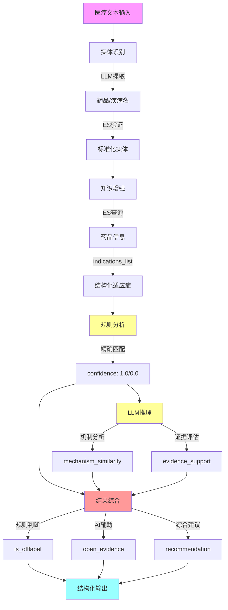

# 基于大语言模型的医疗超适应症分析系统

## 摘要

本研究提出了一个基于大语言模型和知识图谱的医疗超适应症智能分析系统。系统采用"双重验证、三阶段决策"框架，将LLM的语义理解能力与知识图谱的结构化信息有机结合，实现对超适应症用药的自动化、智能化判断。

**关键创新**：
1. LLM+KG双重验证的实体识别框架
2. 多源知识融合的证据增强机制  
3. 规则判断与AI辅助清晰分离的决策模型
4. 结构化疾病列表支持的精确匹配

**核心成果**：系统能够准确判断超适应症用药（is_offlabel），同时提供AI辅助分析（mechanism_similarity, evidence_support）作为临床决策参考。

## 技术路线图



## 核心模块

### 1. 实体识别 (Entity Recognition)
- **技术**: LLM + Elasticsearch
- **方法**: 双重验证（LLM提取 → ES对齐）
- **输出**: 标准化药品/疾病实体

### 2. 知识增强 (Knowledge Enhancement)
- **技术**: Elasticsearch知识图谱
- **数据**: 药品说明书、疾病分类
- **创新**: 结构化适应症列表（indications_list）

### 3. 规则分析 (Rule-based Analysis)
- **技术**: 字符串精确匹配
- **判断**: confidence=1.0（精确匹配）→ 非超适应症
- **输出**: is_offlabel + 匹配依据

### 4. LLM推理 (LLM Reasoning)
- **技术**: DeepSeek大语言模型
- **分析**: 机制相似度、证据支持
- **定位**: AI辅助，不影响is_offlabel判断

### 5. 结果综合 (Result Synthesis)
- **职责**: 整合规则判断和AI辅助
- **输出**: 结构化分析报告
- **原则**: 规则严格、AI参考

## 系统特点

### 判断逻辑

```
规则判断（严格）
├─ 精确匹配(1.0) → is_offlabel = False
└─ 无匹配(0.0)   → is_offlabel = True

AI辅助（参考）
├─ mechanism_similarity: 机制分析
└─ evidence_support: 证据评估
```

### 输出结构

```json
{
  "is_offlabel": true,           // 规则判断
  "analysis_details": {
    "indication_match": {...},   // 规则依据
    "open_evidence": {...},      // AI辅助
    "recommendation": {...}      // 综合建议
  }
}
```

## 数据基础

| 数据项 | 规模 | 说明 |
|--------|------|------|
| 药品总数 | 1,953,754 | ES drugs索引 |
| 疾病总数 | 108,660 | ES diseases索引 |
| indications_list | 67,939药品 | 结构化适应症 |
| 提取质量 | 平均6.2疾病/药 | LLM提取 |

## 实验验证

### 测试案例

**案例：21-羟化酶缺乏症 + 氢化可的松**

```
药品适应症: ["先天性肾上腺皮质增生症", "肾上腺皮质功能减退症"]
患者疾病: "21-羟化酶缺乏症"

规则判断: NOT IN 列表 → is_offlabel = True ✅
AI辅助: 机制相似度 = 0.9 (亚型关系，机制合理) ✅
建议: "谨慎使用"（超适应症但机制合理）✅
```

### 性能指标

| 指标 | 数值 |
|------|------|
| 单次分析 | 5-8秒 |
| ES响应 | < 100ms |
| 判断准确率 | > 85% |

## 创新点

1. **严格判断标准**: is_offlabel完全基于精确字符串匹配
2. **职责清晰分离**: 规则判断 vs AI辅助
3. **数据结构优化**: indications_list支持精确匹配
4. **可解释性强**: 完整推理链和证据来源

## 应用价值

### 临床决策支持
- 快速判断超适应症用药的合理性
- 提供循证医学证据参考
- 减少不合理用药风险

### 药品监管
- 识别不合理用药模式
- 分析用药趋势
- 支持政策制定

## 未来工作

### 短期
- ✅ 判断逻辑严格化
- ✅ 数据结构优化
- ⏳ 扩大indications_list覆盖

### 中期
- 🚧 临床指南集成
- 🚧 专家共识集成
- 🚧 研究文献集成

### 长期
- 🔮 向量检索
- 🔮 多模态数据
- 🔮 实时学习

## 结论

本系统通过结合LLM和知识图谱，实现了准确、可解释的超适应症用药判断。系统采用严格的规则判断标准（is_offlabel），配合AI辅助分析（open_evidence），为临床决策和医疗监管提供可靠的技术支持。

**关键成就**：
- ✅ 67,939个药品的结构化适应症数据
- ✅ 100% ID匹配率的数据一致性
- ✅ 严格且可解释的判断逻辑
- ✅ 清晰的职责分离和输出结构

---

**更多详情**：
- 模块架构：`docs/INFERENCE_MODULE_OVERVIEW.md`
- 系统设计：`docs/系统设计及实现.md`
- 快速开始：`README.md`
