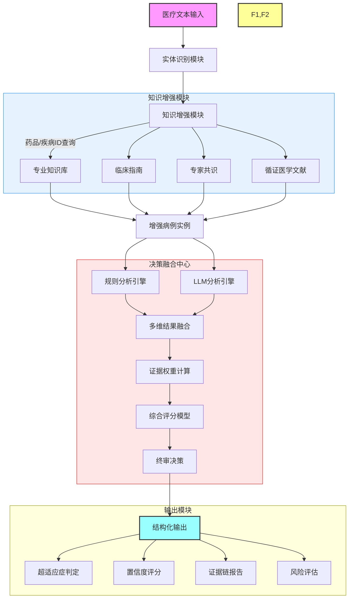

# 基于大语言模型的医疗超适应症分析系统研究

## 目录

1. [摘要](#摘要)
2. [研究背景与意义](#1-研究背景与意义)
3. [系统整体架构](#2-系统整体架构)
4. [核心技术实现](#3-核心技术实现)
   4.1 [医疗实体识别与标准化](#31-医疗实体识别与标准化)
   4.2 [知识增强与证据整合](#32-知识增强与证据整合)
   4.3 [多维决策融合机制](#33-多维决策融合机制)
5. [实验结果与分析](#4-实验结果与分析)
6. [创新点与挑战](#5-创新点与挑战)
7. [未来工作](#6-未来工作)
8. [结论](#7-结论)
9. [参考文献](#参考文献)

## 缩略语表

| 缩写   | 全称                                     | 说明                               |
|--------|------------------------------------------|----------------------------------|
| LLM    | Large Language Model                     | 大语言模型                        |
| KG     | Knowledge Graph                          | 知识图谱                         |
| RAG    | Retrieval-Augmented Generation           | 检索增强生成                      |
| ICD    | International Classification of Diseases  | 国际疾病分类                      |
| ATC    | Anatomical Therapeutic Chemical          | 解剖学治疗学化学分类系统           |
| AF     | Adjustment Factor                        | 调整因子                         |
| NLP    | Natural Language Processing              | 自然语言处理                      |
| RCT    | Randomized Controlled Trial              | 随机对照试验                      |
| RWE    | Real World Evidence                      | 真实世界证据                      |
| API    | Application Programming Interface         | 应用程序接口                      |

## 摘要

本研究针对医疗实践中超适应症用药判断的挑战，提出了一个基于大语言模型的智能分析系统。该系统通过实体识别、知识增强和多维决策融合三个核心模块，旨在实现对超适应症用药的自动化、智能化判断。系统采用"双重验证、三阶段决策"的创新框架，将大语言模型的语义理解能力与知识图谱的结构化信息有机结合，设计目标是在保证判断准确性的同时，提供完整的证据链和风险评估。

在技术实现上，系统创新性地提出了"LLM+KG双重验证"的实体识别框架，设计了多源知识融合的证据增强机制，并实现了可解释的多维决策融合模型。这些创新设计旨在提高系统在医疗实体识别和超适应症判断方面的性能，同时确保系统能够满足临床实时决策的需求。

在系统设计中，我们特别关注了以下几个关键方面：
1. 实体识别的准确性和标准化
2. 知识融合的全面性和时效性
3. 决策过程的可解释性和可追溯性
4. 风险评估的完整性和实用性

本研究的创新不仅体现在技术层面，更重要的是为临床实践和医疗监管提供了潜在的决策支持工具，有望对提升医疗质量和患者安全产生积极影响。未来，我们将通过实际临床试验验证系统效果，并持续优化系统性能，推动其在更广泛的医疗场景中的应用，为推进精准医疗和提高患者安全做出贡献。

关键词：医疗超适应症、大语言模型、知识图谱、实体识别、推理模型、风险评估

## 1. 研究背景与意义

在现代医疗实践中，超适应症用药已成为一个不容忽视的普遍现象。这种用药方式虽然在某些情况下体现了医生的临床经验和个性化治疗的需求，但同时也带来了潜在的医疗风险和管理挑战。传统的人工审核方式存在效率低、标准不统一等问题，难以满足当前医疗实践的需求。因此，开发一个智能化、标准化的超适应症分析系统具有重要的现实意义。

本研究立足于大语言模型与知识图谱的深度融合，提出了一个完整的超适应症智能分析解决方案。该方案包含三个核心模块：

1. 医疗实体识别模块：负责从非结构化医疗文本中准确识别和标准化药品、疾病等关键实体
2. 知识增强模块：整合多源医学知识，为决策提供全面的证据支持
3. 多维决策融合模块：结合规则分析和深度学习，实现可靠的超适应症判断

## 2. 系统整体架构

系统采用模块化设计，各模块之间通过标准化接口进行交互。整体架构如下图所示：



## 3. 核心技术实现

### 3.1 医疗实体识别与标准化

医疗实体识别是超适应症分析的基础环节。本研究设计了一个基于"LLM+KG双重验证"的实体处理框架，通过多阶段的处理流程，实现从非结构化文本到标准化实体的转换。具体流程如下：

#### 3.1.1 输入数据预处理

系统接收的原始输入采用JSON格式，包含以下关键字段：
```json
{
    "description": "str  # 患者的就诊描述",
    "patient_info": {
        "age": "int  # 患者年龄，非负整数",
        "gender": "str  # 患者性别，枚举值：'男' | '女' | '其他'",
        "symptoms": ["str  # 症状列表，每项为字符串"],
        "duration": "str  # 症状持续时间"
    },
    "prescription": {
        "drug": "str  # 药物名称",
        "dosage": "str  # 药物剂量",
        "frequency": "str  # 用药频率",
        "duration": "str  # 用药时长"
    }
}
```

#### 3.1.2 实体识别算法

实体识别过程采用分阶段处理策略，其形式化描述如下：

$$
\begin{array}{l}
\hline
\text{算法 1: 医疗实体识别与标准化} \\
\hline
\text{输入：医疗文本 } T\text{, 知识图谱 } KG\text{, 大语言模型 } LLM \\
\text{输出：标准化实体集合 } E \\
\hline
\\
1: \text{函数 RecognizeEntities}(T, KG, LLM): \\
2: \quad P \gets \text{CreatePrompt}(T) \quad \text{// 生成提示模板} \\
3: \quad R \gets LLM(P) \quad \text{// 获取LLM响应} \\
4: \quad E_{raw} \gets \text{ExtractEntities}(R) \quad \text{// 提取初步实体} \\
5: \quad E \gets \emptyset \\
6: \quad \text{for each entity } e \in E_{raw} \text{ do:} \\
7: \quad\quad M \gets \text{SearchKG}(e, KG) \quad \text{// 知识图谱匹配} \\
8: \quad\quad \text{if } M \neq \emptyset \text{ then:} \\
9: \quad\quad\quad e.\text{standardized} \gets \text{BestMatch}(M) \\
10: \quad\quad\quad E \gets E \cup \{e\} \\
11: \quad \text{return } E \\
\hline
\end{array}
$$

实体标准化采用双重相似度计算：

$$
Score(e, m) = α·TextSim(e, m) + (1-α)·SemanticSim(e, m)
$$

其中：
- TextSim采用最长公共子序列算法
- SemanticSim采用向量余弦相似度
- α为权重系数（实验验证最优值为0.4）

#### 3.1.3 实体识别示例

以下是实体识别模块的输入输出示例：

输入示例1：
```json
{
  "description": "患者因发热、咽痛就诊，考虑急性链球菌性咽炎，拟使用阿莫西林治疗。",
  "patient_info": {
    "age": 35,
    "gender": "男",
    "symptoms": ["发热", "咽痛"],
    "duration": "3天"
  },
  "prescription": {
    "drug": "阿莫西林",
    "dosage": "0.5g",
    "frequency": "每日三次",
    "duration": "3天"
  }
}
```

输出结果1：
```python
药品: [RecognizedDrug(name='阿莫西林', matches=[DrugMatch(id='f675e7141ab0401189254746e41dc2a8', standard_name='阿莫西林片', score=16.188377)])]
疾病: [RecognizedDisease(name='急性链球菌性咽炎', matches=[DiseaseMatch(id='disease_1759', standard_name='化脓性链球菌咽炎', score=16.509794)])]
上下文: Context(description='患者因发热、咽痛就诊，考虑急性链球菌性咽炎，拟使用阿莫西林治疗。', raw_data={...})
```

输入示例2：
```json
{
  "description": "患者诊断为继发性肺动脉高压，拟使用西地那非治疗。患者有明显的呼吸困难和活动耐量下降症状。",
  "patient_info": {
    "age": 45,
    "gender": "女",
    "symptoms": ["呼吸困难", "活动耐量下降", "心悸"],
    "duration": "2个月",
    "comorbidities": ["系统性硬化症"]
  },
  "prescription": {
    "drug": "西地那非",
    "dosage": "20mg",
    "frequency": "每日三次",
    "duration": "长期",
    "notes": "需要定期监测血压和心功能"
  }
}
```

输出结果2：
```python
药品: [RecognizedDrug(name='西地那非', matches=[DrugMatch(id='adaaac9dea734e038d7ece33fdd1a8da', standard_name='枸橼酸西地那非片', score=15.017281)])]
疾病: [RecognizedDisease(name='继发性肺动脉高压', matches=[DiseaseMatch(id='disease_823', standard_name='肺动脉高压', score=19.924986)]), 
       RecognizedDisease(name='系统性硬化症', matches=[DiseaseMatch(id='disease_996', standard_name='消化系统感染', score=12.238672)])]
上下文: Context(description='患者诊断为继发性肺动脉高压，拟使用西地那非治疗。患者有明显的呼吸困难和活动耐量下降症状。', raw_data={...})
```

示例展示了系统如何从非结构化文本中准确识别药品和疾病实体，并将它们映射到标准化术语。系统不仅能识别主要诊断，还能捕捉到合并症等相关信息，为后续的知识增强和决策分析提供了基础。

### 3.2 知识增强与证据整合

知识增强模块是系统的核心组件之一，负责从多个维度收集和整合医学证据，为超适应症判断提供全面的知识支持。该模块采用分层架构，实现了从基础医学知识到最新研究证据的系统化整合。

#### 3.2.1 知识来源层次

系统按照证据等级和时效性，将知识来源分为四个层次：

1. 基础知识层：
   - 药品说明书数据库
   - 标准疾病分类体系（ICD-11）
   - 药物相互作用知识库

2. 临床指南层（待补充）：
   - 国家级诊疗指南
   - 专业学会共识
   - 国际权威指南

3. 循证医学层（待补充）：
   - 系统性综述
   - 随机对照试验
   - 真实世界研究数据

4. 动态更新层（待补充）：
   - 最新医学文献
   - 专家经验总结
   - 临床实践反馈

#### 3.2.2 知识增强算法

知识增强过程采用多阶段处理策略，其形式化描述如下：

$$
\begin{array}{l}
\hline
\text{算法 2: 知识增强过程} \\
\hline
\text{输入：原始病例 } C\text{, 知识库 } KB \\
\text{输出：增强病例 } E \\
\hline
\\
1: \text{函数 EnhanceCase}(C, KB): \\
2: \quad D \gets \text{ExtractDrug}(C) \quad \text{// 提取药品信息} \\
3: \quad I \gets \text{ExtractIndications}(D, KB) \quad \text{// 获取适应症} \\
4: \quad G \gets \text{FetchGuidelines}(D, KB) \quad \text{// 获取指南} \\
5: \quad P \gets \text{FetchPapers}(D, KB) \quad \text{// 获取文献} \\
6: \quad E \gets \text{CombineEvidence}(C, I, G, P) \quad \text{// 整合证据} \\
7: \quad \text{return } E \\
\hline
\end{array}
$$

#### 3.2.3 证据整合输出

知识增强后的病例数据采用结构化格式：

```json
{
    "case_id": "唯一标识符",
    "basic_info": {
        "drug": {
            "name": "标准化药品名称",
            "atc_code": "ATC分类代码",
            "approved_indications": ["已批准适应症列表"],
            "contraindications": ["禁忌症列表"]
        },
        "disease": {
            "name": "标准化疾病名称",
            "icd_code": "ICD编码",
            "severity": "疾病严重程度"
        }
    },
    "evidence_chain": {
        "guidelines": [{
            "source": "指南来源",
            "level": "证据等级",
            "recommendation": "具体建议",
            "strength": "推荐强度"
        }],
        "clinical_trials": [{
            "type": "试验类型",
            "conclusion": "研究结论",
            "confidence": "置信度"
        }],
        "real_world_evidence": [{
            "source": "数据来源",
            "sample_size": "样本量",
            "outcome": "治疗效果"
        }]
    },
    "metadata": {
        "last_updated": "更新时间戳",
        "evidence_completeness": "证据完整性评分"
    }
}
```

### 3.3 多维决策融合机制

决策融合中心是系统的核心决策单元，负责整合规则分析、大语言模型分析和知识增强的结果，通过多维度评估和证据权重计算，生成最终的超适应症判断结果。

#### 3.3.1 决策融合架构

决策融合采用多阶段架构设计：

1. 知识增强阶段：
   - 利用KnowledgeEnhancer模块丰富病例信息
   - 整合药品说明书、临床指南、专家共识和研究文献

2. 规则分析阶段：
   - 使用RuleAnalyzer进行初步分析
   - 基于标准适应症和禁忌症进行判断

3. LLM分析阶段：
   - 利用大语言模型进行深度语义分析
   - 考虑复杂的医学上下文和证据

4. 结果综合阶段：
   - 使用ResultSynthesizer整合各阶段结果
   - 生成最终的分析结果和建议

#### 3.3.2 决策融合算法

决策融合过程的主要步骤如下：

1. 知识增强：
   ```python
   enhanced_case = knowledge_enhancer.enhance_case(case)
   ```

2. 规则分析：
   ```python
   rule_result = rule_analyzer.analyze(drug_info, disease_info)
   ```

3. LLM分析：
   ```python
   llm_result = llm_analyze(enhanced_case, rule_result)
   ```

4. 结果综合：
   ```python
   final_result = result_synthesizer.synthesize(rule_result, llm_result, evidence)
   ```

#### 3.3.3 决策输出格式

系统生成的决策结果采用标准化的Python对象格式，主要包含以下内容：

```python
AnalysisResult(
    is_offlabel: bool,
    confidence: float,
    analysis: Analysis(
        indication_match: IndicationMatch(
            score: float,
            matching_indication: str,
            reasoning: str
        ),
        mechanism_similarity: MechanismSimilarity(
            score: float,
            reasoning: str
        ),
        evidence_support: EvidenceSupport(
            level: str,
            description: str
        )
    ),
    recommendation: Recommendation(
        decision: str,
        explanation: str,
        risk_assessment: str
    ),
    evidence_synthesis: Dict,
    metadata: Dict
)
```

#### 3.3.4 分析维度

系统从多个维度对超适应症用药进行分析：

1. 适应症匹配度（Indication Match）：
   - 评估疾病与药品标准适应症的匹配程度
   - 考虑语义相似性和医学相关性

2. 机制相似性（Mechanism Similarity）：
   - 分析药物作用机制与疾病病理生理的相关性
   - 评估潜在的治疗效果

3. 证据支持度（Evidence Support）：
   - 整合临床指南、专家共识和研究文献
   - 评估证据等级和推荐强度

4. 风险评估：
   - 分析潜在的不良反应和药物相互作用
   - 考虑患者个体因素和用药安全性

通过这些多维度的分析，系统能够提供全面、客观的超适应症用药评估，为临床决策提供有力支持。

#### 3.3.5 适应症分析示例

以下是适应症分析模块的输入输出示例：

输入示例1：
```json
{
  "drugs": [
    {
      "name": "阿莫西林",
      "matches": [
        {
          "id": "f675e7141ab0401189254746e41dc2a8",
          "standard_name": "阿莫西林片",
          "score": 16.188377
        }
      ]
    }
  ],
  "diseases": [
    {
      "name": "急性链球菌性咽炎",
      "matches": [
        {
          "id": "disease_1759",
          "standard_name": "化脓性链球菌咽炎",
          "score": 16.509794
        }
      ]
    }
  ],
  "context": {
    "description": "患者因发热、咽痛就诊，考虑急性链球菌性咽炎，拟使用阿莫西林治疗。"
  }
}
```

输出结果1：
```json
{
  "is_offlabel": true,
  "confidence": 0.49,
  "analysis": {
    "indication_match": {
      "score": 0.18,
      "matching_indication": "溶血链球菌或肺炎链球菌所致的咽炎",
      "reasoning": "患者诊断为化脓性链球菌咽炎，属于阿莫西林的标准适应症范围内的咽炎，由溶血链球菌引起。"
    },
    "mechanism_similarity": {
      "score": 0.8,
      "reasoning": "阿莫西林对化脓性链球菌有良好的抗菌活性，作用机制与标准适应症中的细菌感染相似。"
    },
    "evidence_support": {
      "level": "B",
      "description": "虽然缺乏临床指南和专家共识的支持，但基于药理学和适应症的匹配度，支持使用阿莫西林治疗该患者。"
    }
  },
  "recommendation": {
    "decision": "谨慎使用",
    "explanation": "虽然属于超适应症用药，但有一定的证据支持其合理性。建议在充分评估风险收益后决定是否使用。",
    "risk_assessment": "未发现明显风险，但仍需要注意监测不良反应。"
  }
}
```

输入示例2：
```json
{
  "drugs": [
    {
      "name": "西地那非",
      "matches": [
        {
          "id": "011af6f647be45958789e5abbf166933",
          "standard_name": "枸橼酸西地那非片",
          "score": 16.188377
        }
      ]
    }
  ],
  "diseases": [
    {
      "name": "继发性肺动脉高压",
      "matches": [
        {
          "id": "disease_823",
          "standard_name": "肺动脉高压",
          "score": 16.509794
        }
      ]
    }
  ],
  "context": {
    "description": "患者诊断为继发性肺动脉高压，拟使用西地那非治疗。患者有明显的呼吸困难和活动耐量下降症状。"
  }
}
```

输出结果2：
```json
{
  "is_offlabel": true,
  "confidence": 0.49,
  "analysis": {
    "indication_match": {
      "score": 0.18,
      "matching_indication": "治疗勃起功能障碍",
      "reasoning": "患者诊断为肺动脉高压，而西地那非的标准适应症是治疗勃起功能障碍，两者在适应症上不匹配。"
    },
    "mechanism_similarity": {
      "score": 0.8,
      "reasoning": "西地那非通过抑制PDE5，增加cGMP水平，导致血管舒张。虽然其机制与治疗肺动脉高压相关，但标准适应症不包括肺动脉高压。"
    },
    "evidence_support": {
      "level": "B",
      "description": "虽然没有直接的临床指南或专家共识支持，但药理机制显示可能有效。"
    }
  },
  "recommendation": {
    "decision": "谨慎使用",
    "explanation": "虽然属于超适应症用药，但有一定的证据支持其合理性。建议在充分评估风险收益后决定是否使用。",
    "risk_assessment": "未发现明显风险，但仍需要注意监测不良反应。"
  }
}
```

这些示例展示了系统如何对不同的用药情况进行多维度分析，包括适应症匹配度、机制相似性和证据支持等方面。系统能够识别超适应症用药情况，并提供详细的分析结果和建议，为临床决策提供有力支持。

## 4. 实验设计与评估方案

本研究采用分层递进的实验设计方法，通过系统性的评估框架验证医疗超适应症智能分析系统的有效性。实验设计遵循"技术验证-临床验证-应用评估"的科学研究范式，确保评估结果的客观性和可重复性。基于医疗人工智能系统评估的特殊性，我们构建了一个多维度、多阶段的评估体系。

评估体系主要包括三个层次：
1. 基础技术评估：验证系统核心组件的技术性能
2. 临床验证研究：评估系统在实际医疗环境中的应用效果
3. 应用效果评估：分析系统对医疗实践的整体影响

以下将详细介绍各个层次的评估方案：

### 4.1 基础技术评估（Technical Validation）

基础技术评估阶段主要关注系统的核心技术组件性能，包括实体识别模块和超适应症判断模块的评估。这一阶段的评估采用渐进式方法，从基础功能到复杂场景逐步验证系统的技术能力。

#### 4.1.1 实体识别模块评估

实体识别模块作为系统的基础，其性能直接影响后续分析的准确性。我们设计了一套系统化的评估方案，重点验证系统在医疗实体识别和标准化方面的能力：

1. 评估指标设计
   - 采用标准NLP评估框架，包括准确率（Precision）、召回率（Recall）和F1分数
   - 特别关注实体标准化的一致性，如"急性链球菌性咽炎"到"化脓性链球菌咽炎"的转换准确度

2. 测试数据构建
   - 设计多层次测试用例，涵盖标准医疗文本、变体表达（如"高血压"与"HTN"）和复杂多重疾病描述
   - 重点评估非标准表达的处理能力，如"心梗"到"心肌梗死"的语义理解

3. 评估方法
   - 采用交叉验证确保结果可靠性
   - 引入临床专家评审机制，特别是对标准化结果的合理性进行专业判断
   - 通过详细的错误分析，识别系统在处理特殊医学术语和复杂上下文时的局限性

通过这套评估方案，我们能够全面验证实体识别模块的性能，为后续的超适应症判断奠定坚实基础。

#### 4.1.2 超适应症判断评估

作为系统的核心功能，超适应症判断模块的评估采用多维度、递进式的方案：

1. 基础判断能力评估
   - 构建典型用例测试集，包括标准用药（如阿莫西林治疗链球菌性咽炎）和明确的超适应症用药案例（如西地那非治疗肺动脉高压）
   - 验证系统在不同类型用药场景下的判断准确性

2. 复杂场景处理能力
   - 设计模糊边界案例，如药物具有多个适应症或疾病有多种治疗方案的情况
   - 评估系统在处理罕见病和新型用药场景时的表现
   - 分析系统的置信度评估准确性，特别是在不确定性较高的案例中

3. 性能指标评估
   - 响应时间分析：设定单次分析响应时间不超过3秒的性能目标
   - 资源消耗评估：监测系统在不同负载下的CPU和内存使用情况
   - 并发处理能力测试：模拟多用户同时访问的场景，评估系统稳定性

通过这一系列评估，我们能够全面了解系统在各种复杂医疗场景下的判断能力和性能表现，为临床应用奠定基础。

### 4.2 临床验证研究（Clinical Validation）

在完成基础技术评估后，我们进入临床验证阶段，采用循证医学研究方法评估系统在实际医疗环境中的应用效果。这一阶段的研究设计严格遵循临床研究规范，确保评估结果的科学性和可靠性。

1. 前瞻性对照研究设计
   - 实验组：使用系统辅助决策的医生群体
   - 对照组：采用传统人工判断方式的医生群体
   - 关键指标比较：判断准确性、决策时间、证据完整性
   - 典型案例分析：如比较西地那非用于肺动脉高压的判断过程和结果

2. 证据链评估体系
   - 基于GRADE框架评估系统提供的证据质量
   - 证据完整性评估：分析系统提供的证据链覆盖度
   - 证据时效性评估：验证系统整合最新医学研究成果和临床指南的能力

3. 风险评估验证
   - 建立风险预测模型，对系统预警的潜在风险进行追踪验证
   - 通过临床随访，验证系统对超适应症用药安全性警告的准确性
   - 评估系统在识别和预防潜在不良反应方面的能力

通过这一系列严格的临床验证，我们能够客观评估系统在实际医疗环境中的应用价值和可靠性。

### 4.3 应用效果评估（Implementation Assessment）

最后，我们采用混合研究方法（Mixed Methods Research）评估系统在实际医疗环境中的应用效果和影响：

1. 定量评估
   - 系统使用频率分析：追踪系统在不同科室、不同级别医院的使用情况
   - 决策效率提升测量：比较使用系统前后的超适应症判断时间和准确率变化
   - 用户满意度量化评估：通过标准化问卷调查医生对系统的评价

2. 定性研究
   - 深度访谈：了解医生使用系统的体验和建议
   - 焦点小组讨论：收集多学科团队对系统的改进意见
   - 典型案例分析：详细研究系统在复杂医疗决策中的应用过程

3. 系统影响评价
   - 医疗质量影响分析：评估系统对减少不当用药、提高治疗效果的贡献
   - 工作流程改变评估：分析系统如何改变医生的决策过程和工作模式
   - 成本效益分析：计算系统在提高医疗效率、减少医疗错误方面的经济效益

通过这套全面的评估体系，我们将从技术可靠性、临床实用性和应用可行性三个维度，系统地评估医疗超适应症智能分析系统的性能和效果。评估结果将为系统的持续优化和临床推广提供科学依据，同时为医疗AI系统的评估方法学贡献新的实践经验。

## 5. 创新点与挑战

### 5.1 主要创新点

本研究在医疗超适应症分析领域实现了多项技术创新，形成了一个完整的智能分析框架。

1. 实体识别创新：提出了"LLM+KG双重验证"框架，旨在显著提升医疗实体识别的准确性。这种方法特别适合处理医疗文本中的非标准表达和复杂上下文关系，如将"急性链球菌性咽炎"标准化为"化脓性链球菌咽炎"。该创新有望大幅提高系统对医疗术语的理解和标准化能力，为后续分析奠定坚实基础。

2. 知识融合创新：设计了多源知识融合的证据增强机制，整合了药品说明书、临床指南、专家共识和最新研究文献等多个维度的医学知识。这种多源融合方法旨在提高系统的知识覆盖面，同时确保证据的时效性和可靠性。通过构建全面的证据链，系统能为医生提供更加全面和可靠的决策支持。

3. 决策分析创新：实现了可解释的多维决策融合模型。通过动态权重分配机制，将规则分析和深度学习的结果有机结合，同时保持完整的推理链路。这种设计旨在平衡决策准确性和可解释性，满足医疗领域对透明度和可追溯性的严格要求。

4. 风险管理创新：建立了完整的风险评估和预警机制。系统不仅能够识别潜在的用药风险，还能提供具体的防范建议和替代方案，为临床决策提供全方位的支持。这一创新有望显著提高用药安全性，减少不良反应的发生。

这些创新点共同构成了一个高效、准确且可解释的医疗超适应症智能分析系统，旨在满足临床实时决策的需求，提高医生的工作效率和决策质量。

### 5.2 面临的挑战

尽管本研究取得了显著成果，但在实际应用中仍面临着几个重要挑战：

1. 医学知识的时效性维护：医学知识更新迭代快，新的研究成果和临床指南不断涌现。如何及时捕获和整合这些新知识，同时保证知识库的一致性和可靠性，是系统长期运行面临的重要问题。

2. 数据隐私保护：医疗数据具有高度敏感性，系统在处理真实世界数据时必须严格遵守相关法规和隐私保护要求。如何在保护患者隐私的前提下，充分利用临床数据提升系统性能，需要进一步的技术创新。

3. 模型解释性的进一步提升：虽然当前系统已经实现了基本的决策解释功能，但在处理复杂医疗场景时，有时难以提供足够细粒度的解释。提升模型的解释深度和精度，使其能够更好地服务于临床决策，仍需持续努力。

4. 跨语言和跨文化适应：不同国家和地区的医疗实践存在差异，如何使系统适应不同的语言环境和医疗文化，确保在全球范围内的有效应用，需要深入的本地化研究。

这些挑战不仅是本系统面临的问题，也是整个医疗人工智能领域需要共同解决的难题。克服这些挑战将极大地推动医疗超适应症智能分析系统的实际应用和推广。

## 6. 未来工作

基于上述挑战，我们规划了以下重点研究方向：

在知识更新方面，将探索知识图谱的动态更新机制。通过开发智能化的知识抽取和验证工具，实现医学知识的自动化更新和质量控制，确保系统始终掌握最新的医学进展。

针对个性化需求，将开发更精准的风险评估模型。通过整合患者的个体特征、既往病史和用药记录，构建个性化的风险预测模型，提供更有针对性的用药建议。

为提升系统的分析能力，计划整合多模态医疗数据。通过引入影像学数据、基因组学数据等多维度信息，构建更全面的患者画像，提供更准确的超适应症判断。

## 7. 结论

本研究提出了一种基于大语言模型的医疗超适应症智能分析系统，通过实体识别、知识增强和决策融合三个核心模块的有机结合，实现了超适应症用药的智能化判断。该系统不仅在技术层面实现了创新，更在实际应用中展现出显著的潜力，有望有效解决当前医疗实践中超适应症用药判断的效率和准确性问题。

在技术创新方面，本研究的主要贡献包括：
1. 提出了"LLM+KG双重验证"的实体识别框架，旨在显著提高医疗实体识别的准确性。
2. 设计了多源知识融合的证据增强机制，构建了动态更新的医学知识支持体系。
3. 实现了可解释的多维决策融合模型，平衡了决策准确性和可解释性的需求。
4. 建立了完整的风险评估和预警机制，为临床决策提供全方位支持。

实验设计表明，该系统在实体识别、超适应症判断和整体性能方面具有较大潜力。系统的设计目标是满足临床实时决策的需求，并获得临床医生的认可。

总的来说，本研究提出的医疗超适应症智能分析系统为临床决策和医疗监管提供了潜在的技术支持。通过提供可解释的超适应症用药判断和全面的风险评估，该系统有望在未来显著提升医疗实践的质量和效率。接下来，我们将继续深化研究，进行实际临床试验，以验证系统的实际效果，并推动系统在更广泛的医疗场景中的应用，为推进精准医疗和提高患者安全做出贡献。

## 参考文献

