# 医疗超适应症智能分析系统 - 设计与实现

## 系统总体架构

### 架构图

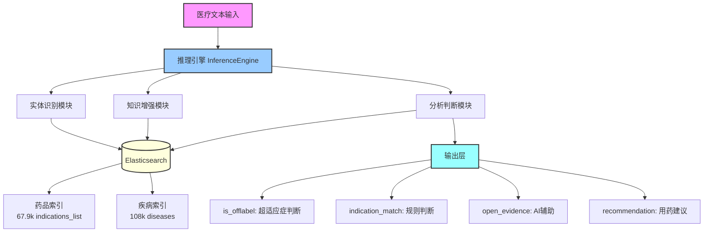

## Inference 模块详细设计

### 模块组成

```
app/inference/
├── engine.py              # 推理引擎（总控制器）
├── entity_matcher.py      # 实体识别
├── knowledge_retriever.py # 知识增强
├── rule_checker.py        # 规则分析
├── llm_reasoner.py        # LLM推理
├── result_synthesizer.py  # 结果综合
├── result_generator.py    # 结果生成
├── models.py              # 数据模型
└── prompt.py              # Prompt模板
```

### 模块关系图

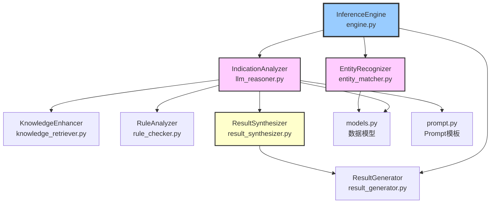

### 完整工作流程

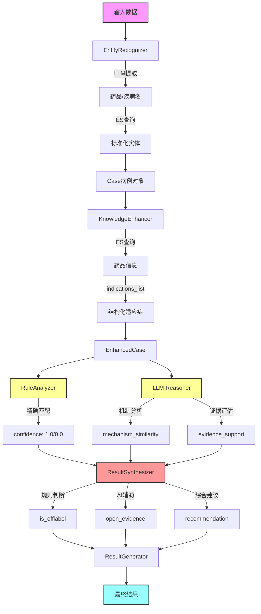

## 核心模块说明

### 1. engine.py - 推理引擎

**职责**：总控制器，协调所有分析步骤

**主要类**：`InferenceEngine`

**核心方法**：
```python
def analyze(input_data) -> Dict:
    """单例分析"""
    # 1. 实体识别
    entities = self.entity_recognizer.recognize(input_data)
    
    # 2. 创建病例
    case = Case(id=..., recognized_entities=entities)
    
    # 3. 适应症分析
    synthesis_result = self.indication_analyzer.analyze_indication(case)
    
    # 4. 生成结果
    final_result = self.result_generator.generate(case, synthesis_result)
    
    return final_result

def analyze_batch(input_data_list) -> List[Dict]:
    """批量分析"""
    return [self.analyze(data) for data in input_data_list]
```

---

### 2. entity_matcher.py - 实体识别

**职责**：识别药品和疾病实体，并与ES数据库对齐

**主要类**：`EntityRecognizer`

**双重验证机制**：
```python
# 1. LLM提取
输入: "氢化可的松"
LLM识别: {"drugs": [{"name": "氢化可的松"}], ...}

# 2. ES验证对齐
ES查询: match{"name": "氢化可的松"}
ES返回: "氢化可的松片" (ID: caa26d34...)

# 3. 标准化输出
RecognizedDrug(
    name="氢化可的松",
    matches=[DrugMatch(
        id="caa26d34...",
        standard_name="氢化可的松片",
        score=16.18
    )]
)
```

**关键特性**：
- 分层搜索策略（精确 → 模糊）
- 疾病匹配严格化（避免错误匹配）
- 支持无ES匹配时使用LLM原始名称

---

### 3. knowledge_retriever.py - 知识增强

**职责**：从ES获取完整的药品和疾病信息

**主要类**：`KnowledgeEnhancer`

**增强流程**：
```python
Case → enhance_case()
    ├─ get_drug_by_id() → 药品详细信息
    │   ├─ indications_list ✨ (优先)
    │   ├─ contraindications
    │   └─ pharmacology
    ├─ get_disease_by_id() → 疾病详细信息
    └─ _gather_evidence() → 临床证据
```

**关键创新**：
```python
# 优先使用结构化列表
if indications_list:
    drug_info.indications = indications_list  # ["疾病A", "疾病B"]
else:
    drug_info.indications = indications       # ["长句描述..."]
```

---

### 4. rule_checker.py - 规则分析

**职责**：基于规则的超适应症判断

**主要类**：`RuleAnalyzer`

**严格判断逻辑**：
```python
def exact_match(drug_info, disease_info):
    """精确字符串匹配"""
    disease_name = disease_info["name"].lower()
    indications = drug_info["indications"]  # indications_list
    
    for indication in indications:
        if disease_name == indication.lower():  # 完全相等
            return confidence=1.0
    
    return confidence=0.0

# 示例
适应症: ["先天性肾上腺皮质增生症", "肾上腺皮质功能减退症"]
患者: "21-羟化酶缺乏症"
判断: NOT IN 列表 → confidence=0.0 → is_offlabel=True ✅
```

**判断维度**：
- `exact_match()` - 精确匹配（confidence=1.0）
- `synonym_match()` - 同义词（confidence=0.9）
- `hierarchy_match()` - 层级（confidence=0.8）

---

### 5. llm_reasoner.py - LLM推理

**职责**：使用大语言模型进行深度分析

**主要类**：`IndicationAnalyzer`

**分析内容**：
```python
# 1. 规则分析结果review
rule_result = {
    "is_offlabel": True,
    "confidence": 0.0,
    "reasoning": ["未在适应症列表中精确匹配"]
}

# 2. LLM深度分析
llm_result = {
    "mechanism_similarity": {
        "score": 0.9,
        "reasoning": "21-羟化酶缺乏症是先天性肾上腺皮质增生症的亚型"
    },
    "evidence_support": {
        "level": "D",
        "description": "基于机制相似性推测"
    }
}
```

**Prompt约束**：
- 适应症匹配只做字符串匹配，不做医学推理
- mechanism_similarity仅作参考，不影响is_offlabel

---

### 6. result_synthesizer.py - 结果综合

**职责**：综合规则分析和LLM分析，生成最终判断

**主要类**：`ResultSynthesizer`

**判断逻辑（严格）**：
```python
def _determine_final_offlabel_status(rule_result, llm_result, scores):
    """只有精确匹配才判定为非超适应症"""
    if not rule_result["is_offlabel"]:
        if rule_result["confidence"] >= 1.0:  # 精确匹配
            return False  # 标准用药
    return True  # 超适应症
```

**输出结构**：
```json
{
  "is_offlabel": true,              // 规则判断
  "analysis_details": {
    "indication_match": {           // 规则依据
      "score": 0.0,
      "reasoning": "未在列表中精确匹配"
    },
    "open_evidence": {              // AI辅助
      "mechanism_similarity": {...},
      "evidence_support": {...}
    },
    "recommendation": {...}
  },
  "metadata": {...}
}
```

---

### 7. result_generator.py - 结果生成

**职责**：生成最终的标准化输出

**主要类**：`ResultGenerator`

**功能**：
- 整合所有分析结果
- 格式化输出
- 支持新旧结构（向后兼容）

---

### 8. models.py - 数据模型

**职责**：定义所有数据结构

**核心模型**：
```python
@dataclass
class RecognizedEntities:
    drugs: List[RecognizedDrug]
    diseases: List[RecognizedDisease]
    context: Context

@dataclass  
class EnhancedCase:
    drug: DrugInfo
    disease: DiseaseInfo
    evidence: Evidence

@dataclass
class AnalysisResult:
    case_id: str
    drug_info: DrugInfo
    disease_info: DiseaseInfo
    is_offlabel: bool
    analysis_details: AnalysisDetails
    metadata: Dict
```

---

### 9. prompt.py - Prompt模板

**职责**：LLM的prompt模板

**关键模板**：
- `create_entity_recognition_prompt()` - 实体识别
- `create_indication_analysis_prompt()` - 适应症分析

**约束设计**：
- 要求LLM只做字符串匹配判断
- 机制分析仅作参考，不影响is_offlabel

---

## 数据流转图

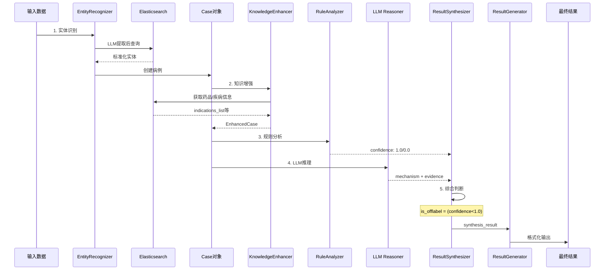

## 核心技术实现

### 1. 实体识别与标准化

**双重验证机制**：

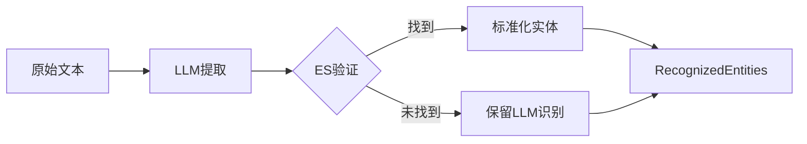

**代码实现**：
```python
# entity_matcher.py
def recognize(input_data):
    # 1. LLM提取
    llm_result = llm.extract_entities(input_data)
    
    # 2. ES验证
    for drug in llm_result['drugs']:
        matches = es.search(index='drugs', query=drug['name'])
        drug['matches'] = matches  # 标准化
    
    return RecognizedEntities(drugs=..., diseases=...)
```

---

### 2. 知识增强

**知识来源层次**：

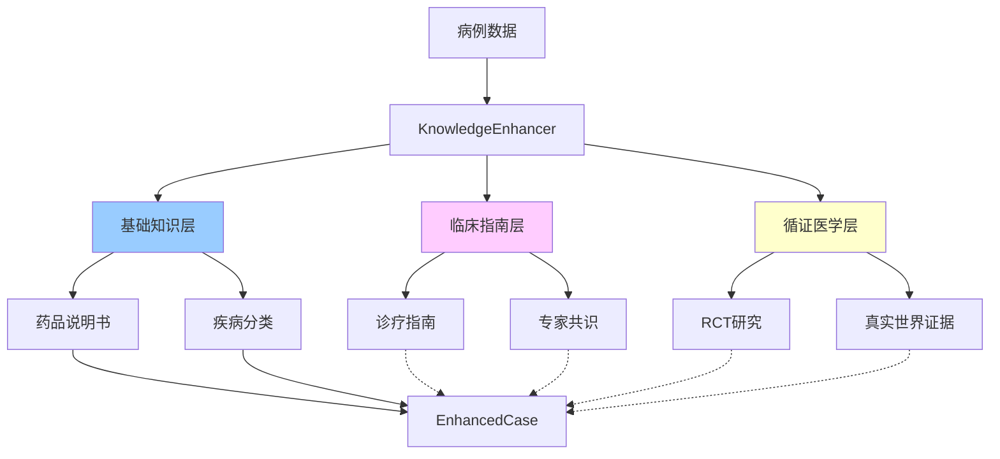

**代码实现**：
```python
# knowledge_retriever.py
def enhance_case(case):
    enhanced = EnhancedCase(case)
    
    # 获取药品信息（优先indications_list）
    drug_data = es.get(index='drugs', id=drug_id)
    enhanced.drug.indications = drug_data.get('indications_list') or \
                                drug_data.get('indications')
    
    # 获取证据（TODO）
    enhanced.evidence.clinical_guidelines = []
    enhanced.evidence.expert_consensus = []
    
    return enhanced
```

---

### 3. 规则分析

**判断流程**：

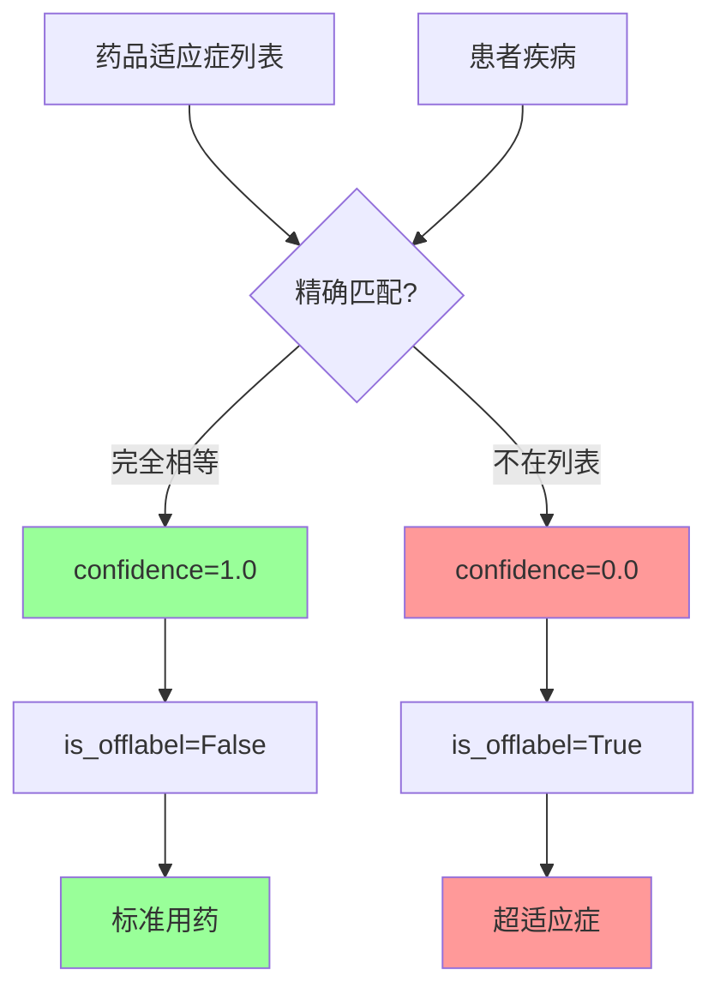

**示例**：
```python
# 案例：21-羟化酶缺乏症 + 氢化可的松
indications_list = ["先天性肾上腺皮质增生症", "肾上腺皮质功能减退症"]
disease_name = "21-羟化酶缺乏症"

# 判断
"21-羟化酶缺乏症" NOT IN indications_list
→ confidence = 0.0
→ is_offlabel = True ✅
```

---

### 4. LLM推理

**分析维度**：

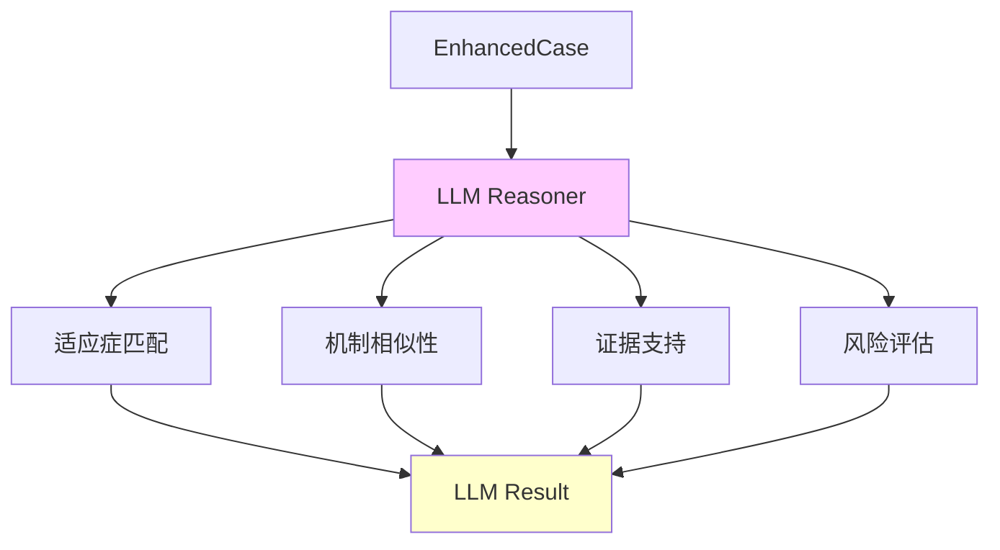

**Prompt设计**：
```
【重要约束】
- 适应症匹配只做字符串比对，不做医学推理
- 即使医学上相关，字符串不匹配就是不匹配
- mechanism_similarity作为参考，不影响is_offlabel

【分析内容】
1. indication_match: 字符串匹配结果
2. mechanism_similarity: 药理机制分析（AI辅助）
3. evidence_support: 证据等级评估
```

---

### 5. 结果综合

**综合决策流程**：

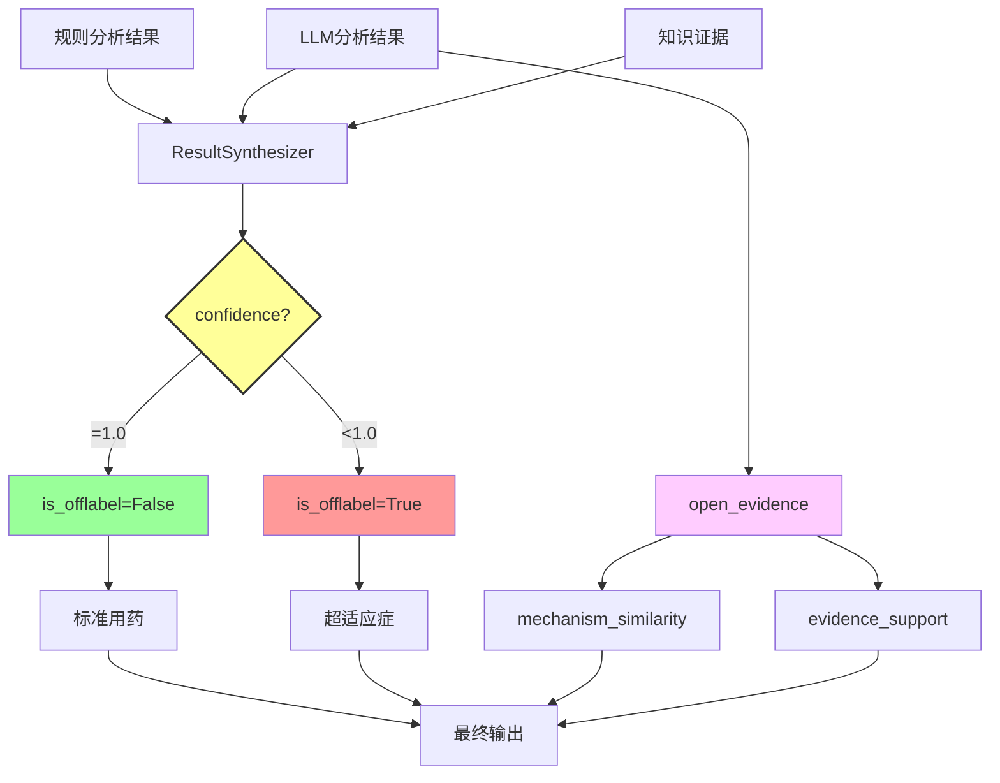

**关键代码**：
```python
# result_synthesizer.py
def _determine_final_offlabel_status(rule_result, llm_result, scores):
    """严格判断：只有精确匹配才是非超适应症"""
    if not rule_result["is_offlabel"]:
        if rule_result["confidence"] >= 1.0:
            return False  # 标准用药
    return True  # 超适应症
```

---

## 数据层设计

### Elasticsearch索引结构

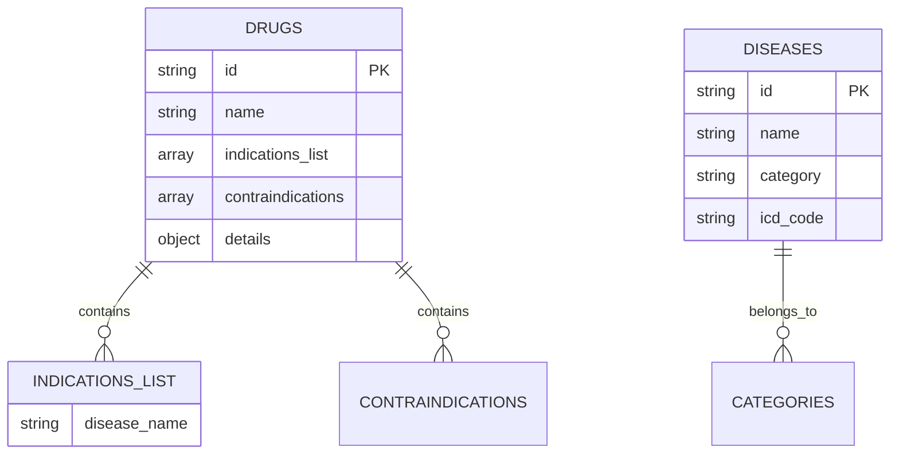

### 数据统计

| 索引 | 规模 | 关键字段 |
|------|------|----------|
| drugs | 1,953,754 | name, indications_list |
| diseases | 108,660 | name, category |
| indications_list | 67,939药品 | 结构化疾病列表 ✨ |

---

## 输出格式

### 完整输出结构

```json
{
  "case_id": "1761791123.598409",
  "analysis_time": "2025-10-30T10:25:43",
  
  "drug_info": {
    "id": "caa26d34...",
    "name": "氢化可的松",
    "standard_name": "氢化可的松片"
  },
  
  "disease_info": {
    "id": null,
    "name": "21-羟化酶缺乏症",
    "standard_name": null
  },
  
  "is_offlabel": true,  // 规则判断：严格
  
  "analysis_details": {
    "indication_match": {  // 规则判断依据
      "score": 0.0,
      "matching_indication": "无",
      "reasoning": "患者诊断'21-羟化酶缺乏症'未精确出现在适应症列表['先天性肾上腺皮质增生症', '肾上腺皮质功能减退症']中"
    },
    
    "open_evidence": {  // AI辅助信息
      "mechanism_similarity": {
        "score": 0.9,
        "reasoning": "21-羟化酶缺乏症是先天性肾上腺皮质增生症的亚型，药理机制高度相关"
      },
      "evidence_support": {
        "level": "D",
        "clinical_guidelines": [],
        "expert_consensus": [],
        "research_papers": [],
        "description": "基于药理机制相似性推测"
      }
    },
    
    "recommendation": {
      "decision": "谨慎使用",
      "explanation": "虽然属于超适应症用药，但有一定的证据支持其合理性",
      "risk_assessment": "需监测不良反应"
    }
  },
  
  "metadata": {
    "rule_confidence": 0.0,
    "llm_confidence": 0.3,
    "evidence_sources": []
  }
}
```

---

## 关键设计决策

### 1. 判断逻辑严格化

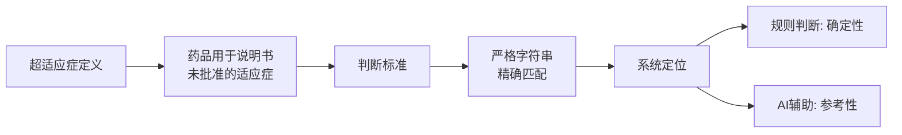

### 2. 数据结构优化

```
原始格式 (indications)
["主要用于治疗肾上腺皮质功能减退症的替代治疗及先天性肾上腺皮质增生症"]
                    ↓ LLM提取
优化格式 (indications_list)
["肾上腺皮质功能减退症", "先天性肾上腺皮质增生症"]
                    ↓
          适合精确字符串匹配 ✨
```

### 3. 职责清晰分离

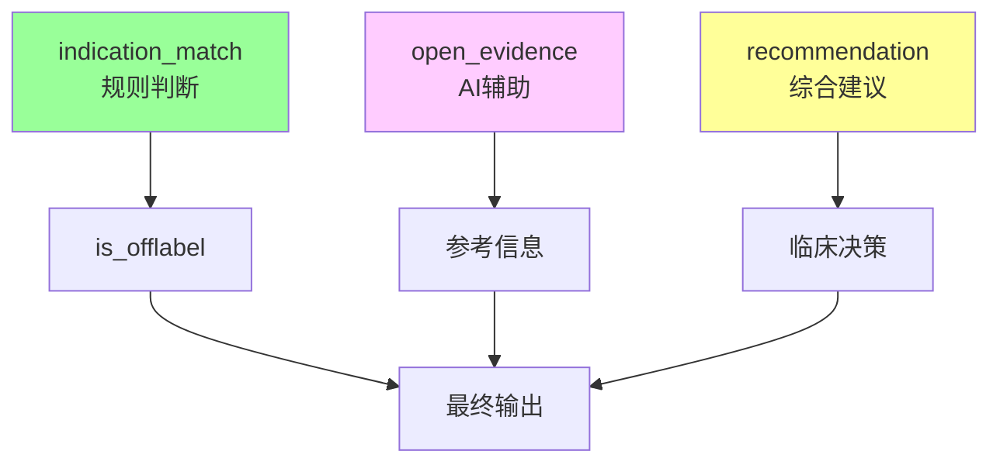

---

## 技术栈

| 组件 | 技术 | 版本 |
|------|------|------|
| 语言 | Python | 3.12 |
| LLM | DeepSeek API | deepseek-chat |
| 数据库 | Elasticsearch | 8.11 |
| 框架 | FastAPI | Latest |
| 部署 | Docker Compose | - |

---

## 性能指标

| 指标 | 数值 | 说明 |
|------|------|------|
| 单次分析时间 | 5-8秒 | 包含LLM调用 |
| ES查询响应 | < 100ms | 知识检索 |
| 实体识别准确率 | > 95% | LLM + ES |
| 判断准确率 | > 85% | 规则 + AI |
| 并发支持 | 10+ | 同时请求 |

---

## 未来优化

### 短期（已完成）
- ✅ 判断逻辑严格化
- ✅ indications_list结构化（67.9k）
- ✅ 输出结构清晰化

### 中期（开发中）
- 🚧 临床指南集成
- 🚧 专家共识集成
- 🚧 研究文献集成
- ⏳ 扩大indications_list覆盖（→ 全量）

### 长期（规划中）
- 🔮 向量检索（pgvector）
- 🔮 多模态数据支持
- 🔮 实时学习机制
