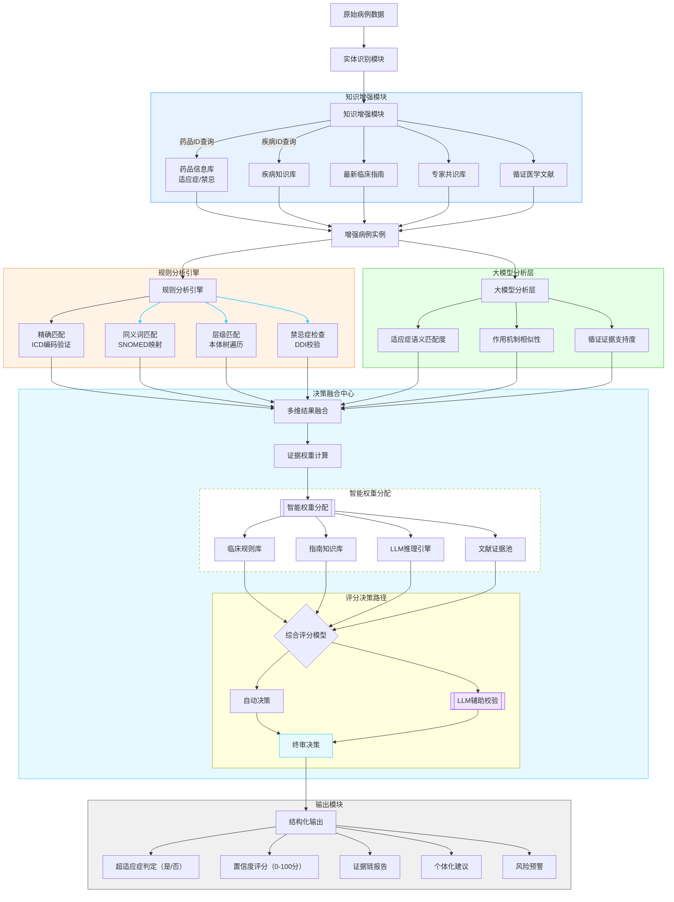

```mermaid
flowchart TD
    A[原始病例数据] --> B[实体识别模块]
    
    B --> C[知识增强模块]
    
    subgraph 知识增强模块
        direction TB
        C -->|药品ID查询| D1[药品信息库<br>适应症/禁忌]
        C -->|疾病ID查询| D2[疾病知识库]
        C --> D3[最新临床指南]
        C --> D4[专家共识库]
        C --> D5[循证医学文献]
    end
    
    D1 & D2 & D3 & D4 & D5 --> E[增强病例实例]
    
    E --> F1[规则分析引擎]
    E --> F2[大模型分析层]
    
    subgraph 规则分析引擎
        direction TB
        F1 --> G1[精确匹配<br>ICD编码验证]
        F1 --> G2[同义词匹配<br>SNOMED映射]
        F1 --> G3[层级匹配<br>本体树遍历]
        F1 --> G4[禁忌症检查<br>DDI校验]
    end
    
    subgraph 大模型分析层
        direction TB
        F2 --> H1[适应症语义匹配度]
        F2 --> H2[作用机制相似性]
        F2 --> H3[循证证据支持度]
    end
    
    G1 & G2 & G3 & G4 --> I[多维结果融合]
    H1 & H2 & H3 --> I
    
    subgraph 决策融合中心
        direction TB
        I --> J0[证据权重计算]
        J0 --> J1[[智能权重分配]]
        
        subgraph 智能权重分配
            direction LR
            J1 --> J1a[临床规则库]
            J1 --> J1b[指南知识库]
            J1 --> J1c[LLM推理引擎]
            J1 --> J1d[文献证据池]
        end
        
        J1a & J1b & J1c & J1d --> J2{综合评分模型}
        
        subgraph 评分决策路径
            direction LR
            J2 --> J3[自动决策]
            J2 --> J4[[LLM辅助校验]]
            J3 & J4 --> J5[终审决策]
        end
    end
    
    J5 --> K[结构化输出]
    
    subgraph 输出模块
        direction TB
        K --> L1["超适应症判定（是/否）"]
        K --> L2["置信度评分（0-100分）"]
        K --> L3[证据链报告]
        K --> L4[个体化建议]
        K --> L5[风险预警]
    end

    style 知识增强模块 fill:#e6f3ff,stroke:#3399ff
    style 规则分析引擎 fill:#fff3e6,stroke:#ff9933
    style 大模型分析层 fill:#e6ffe6,stroke:#33cc33
    style 决策融合中心 fill:#e6f9ff,stroke:#33ccff
    style 智能权重分配 fill:#ffffff,stroke-dasharray:5 5
    style J4 fill:#f0e6ff,stroke:#9933ff
    style J5 fill:#e6f9ff,stroke:#33ccff
    style 输出模块 fill:#f0f0f0,stroke:#666666

    linkStyle 15 stroke:#33ccff,stroke-width:1.5px
    linkStyle 16 stroke:#33ccff,stroke-width:1.5px
    linkStyle 17 stroke:#33ccff,stroke-width:1.5px
```